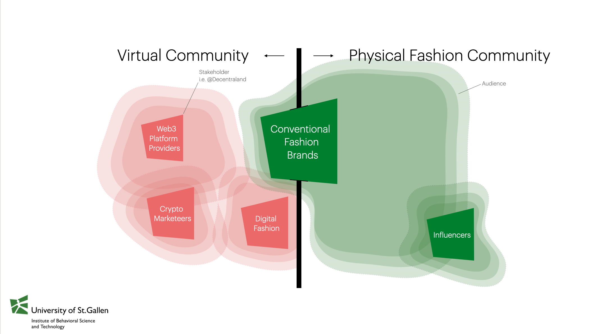

<!--
# To render the output to another directory, use the following lines in the YAML header
# Thanks https://stackoverflow.com/a/71826276
knit: (function(input, ...) {
    rmarkdown::render(
      input,
      output_dir = "../"
    )
  })
-->


```{r setup, include=FALSE}
knitr::opts_chunk$set(echo = FALSE)
```

```{r settings}
options(stringsAsFactors = FALSE)
invisible(Sys.setlocale(category = "LC_ALL", locale = "C"))
set.seed(42)
```

```{r packages}
# install.packages("pacman")
pacman::p_load(magrittr, data.table, stringr, lubridate, # overviewR,
               ggplot2, ggtern, MetBrewer, knitr, fs, purrr,
               qdapRegex)
```

```{r design}
# ggplot layout
layout <- theme(panel.background = element_rect(fill = "transparent", color = NA),
                plot.background = element_rect(fill = "transparent", color = NA),
                panel.grid = element_blank(),
                panel.grid.major.y = element_blank(),
                legend.key = element_rect(fill = "transparent"),
                axis.line = element_line(size = 0.25),
                axis.ticks = element_line(size = 0.25),
                plot.caption = element_text(colour = "#555555"),
                legend.title = element_blank()
)

# color
# colors <- met.brewer(name="Tam",n=7,product="discrete")
cPrimary = "#00802F"
cSecondary = "#EB6969"
cInfo = "#FFF04B"
cDanger <- "#EB6969"
```

```{r constants}
STARTDATE <- as.Date("2022-03-23")
ENDDATE   <- as.Date("2022-03-27")
```


# Background

- Recent shifts toward the _metaverse pose a challenge to the dominant logic of conventional branding_ and connecting consumers to brands through digital assets ([Hofstetter et al. 2022](https://link.springer.com/article/10.1007/s11002-022-09639-2); [Colicev 2022](https://doi.org/10.1016/j.ijresmar.2022.07.003)).
- The seminal focus in this emerging area of marketing is the assumption that blending online and offline experiences in the metaverse enhances engagement and builds more communal experiences between brands and consumers.
- One trend is the inception of _major brand events performed in the metaverse. The Metaverse Fashion Week_ (MVFW), designed to provide immersive, digital fashion experiences, is a recent example.
- The current work explores how fashion brands and other stakeholders in the metaverse (consumers, influencers, digital platform providers and crypto marketeers) _shape and funnel attention_ during these events.


# Research Question

> Which of these stakeholders contribute and capitalize during major branding events in the metaverse and through which specific engagement tactics.


# Conceptual Model & Scoping of Key Stakeholders



- Conventional fashion brands (green) open the gates between the physical and virtual sphere, i.e. web3.
- Simultaneously, brands also expose their audiences to the native web3 stakeholders (red).
- Hence, passive stakeholders risk to lose attention to other stakeholders and spheres.
- We utilize scraped twitter data to identify key stakeholders and show how they manage to capitalize attention during a major digital fashion event (MVFW).


# Methods

We scraped tweets covering the MVFW & classify users into the respective groups of stakeholders outlined previously. We then compare their activity as well as the corresponding engagement metrics.

**Why MVFW?**

- First large-scale metaverse event designed to attract a broad range of user groups.
- This attracts stakeholders as well as audiences from both physical and virtual spheres.
- Existence of free-riding possibilities.

**Why twitter?**

- Represents voices of stakeholders and actions of attending and non-attending audiences.

## Query

```
twint -s "mvfw OR (Metaverse Fashion Week)" --since "2022-03-23" --until "2022-03-28" --lang "en" -o dev/mvfw/data/timeFrames/tmp5.csv --csv
```

- Tweets^[We use [TWINT](https://github.com/twintproject/twint) and the command line interface.] mentioning either `mvfw` or `metaverse`, `fashion` & `week`.
- 4 weeks prior, during and 4 weeks after the event.
- Incremental procedure to reduce sampling issues^[Because twitter limits scrolls while browsing a timeline, one can scrape about [3200 tweets per query](https://github.com/twintproject/twint#limits-imposed-by-twitter). For this reason, we run multiple queries and vary the time frames.].
- Additional search for brands.^[In addition, we scrape data by usernames that represent brands we identified synthesizing different news articles that covered the event (e.g. [1](https://www.voguebusiness.com/technology/metaverse-fashion-week-the-hits-and-misses), [2](https://www.vogue.com/article/metaverse-fashion-week-decentraland), [3](https://decentraland.org/blog/announcements/metaverse-fashion-week-is-here/#flagship-stores), [4](https://www.lifestyleasia.com/ind/gear/tech/highlights-from-2022-metaverse-fashion-week/) and [5](https://metaversefashionweek.com/)). This yields a list of 27 usernames that you can see with `brands[, unique(usernames)]`.] ^[More precisely, we used the following query: `twint -u [username] -s "mvfw OR (Metaverse Fashion Week)" --since "2022-02-23" --until "2022-04-24" --lang "en" -o dev/mvfw/data/brands/[username].csv --csv`.]

_You can find all of the queries [here](https://github.com/Howquez/mvfw/blob/main/data/queries.xlsx)._


## Data

```{r readBatchesTiming}
data_path    <- "../data/timeFrames/"
file_paths   <- fs::dir_ls(path = data_path, glob = "*.csv")
object_names <- str_replace_all(string = file_paths,
                                pattern = paste0(data_path, "|\\.csv"),
                                replacement = "")
datasets     <- purrr::map(file_paths, read.csv, sep = "\t")
tmp <- data.table::rbindlist(l = datasets)
```

```{r readBatchesBrands}
data_path   <- "../data/brands/"
file_paths  <- fs::dir_ls(path = data_path, glob = "*.csv")
datasets    <- purrr::map(file_paths, read.csv, sep = "\t")
brands <- data.table::rbindlist(l = datasets)
```

```{r combineData}
temp <- data.table::rbindlist(l = list(tmp, brands))
```


```{r transformData, warning = FALSE}
# String clean up 
temp[, tweet := iconv(tweet, "latin1", "ASCII", sub = "")]
temp[, tweet := rm_url(tweet,                    # remove URLs
                      pattern = pastex("@rm_twitter_url", "@rm_url"))]

# subset english sample of UNIQUE tweets
data <- temp[language == "en"] %>% unique(by = "tweet")

# create distinc ID
data[, doc_id := .I]

# change date & time format
data[, created_at := str_sub(string = created_at,
                           start  = 1,
                           end    = 19) %>% ymd_hms()]
data[, date := ymd(date)]

# store mentions (@....)
data[, customMentions := str_extract_all(string = tweet,
                                       pattern = "@\\S+")]
data[customMentions == "character(0)", 
   customMentions := NA]
data[, nMentions := str_count(string = customMentions, pattern = "@")]
```

```{r addTimings}
data[, timing := "after"]
data[date <= ENDDATE, timing := "during"]
data[date < STARTDATE, timing := "before"]

data[, timing := factor(timing,
                        ordered = TRUE,
                        levels  = c("before", "during", "after"))]
```

- `r data[, username %>% unique() %>% length %>% format(big.mark = ",")]` unique users and
`r data[, tweet %>% unique() %>% length %>% format(big.mark = ",")]` unique English tweets.
- Passive and active engagement metrics (`likes`, `replies` & `retweets`).


# Results

```{r classifyCryptoMarketeers}
data[str_detect(string = username,
                pattern = "nfts?|crypt|krypt|meta|block|coin"),
     `:=`(domain = "web3",
          product   = "content")]
```

```{r classifyInfluencers}
data[str_detect(string = username,
                pattern = "fashion|beauty|luxury"),
     `:=`(domain = "physical",
          product   = "content")]
```

```{r classifyBrands}
# tag fashion brands
data[username %in% brands[, unique(username)], # NAME BRANDS HERE!
     `:=`(domain = "physical",
          product   = "fashion")]
```

```{r warning = FALSE, eval = FALSE}
tmp <- data[is.na(domain), 
     .(likes = sum(likes_count, na.rm = TRUE)),
     by = username][order(-likes)]

ggplot(data = tmp[likes > 0 & likes < 1000],
       mapping = aes(x = likes)) +
  # geom_histogram(fill = cPrimary, binwidth = 5) +
  geom_density(fill = cPrimary, alpha = 0.66, col = cPrimary) +
  scale_y_continuous(limits = c(0, NA),
                     expand = c(0, NA)) +
  layout

```

```{r classifyManually}

# tag crypto marketeers
data[username %in% c("Deadfellaz", "gossapegirl", "asian_mint", "canessadcl",     # NAME WEB3 HERE!
                     "ericpi888", "itskac", "antisecretsoci2", "cmnnewsofficial",
                     "cathyhackl", # maybe too much fame to be a free rider?
                     "btctn", "_mannyalves", "maryanadcl", "martinshibuya",
                     "eagle_stephen_", "8sianmom", "tokens_com", "mrbathinape",
                     "michi_todd", "bitpanda", "brytehall", "universelle_io",
                     "kcain1982", "borgetsebastien", "barbarakahn", "diviproject",
                     "ziziverse", "astronotseth", "yannakis_dcl", "xpozd_io",
                     "tangpoko", "thesevens_7", "portionapp", "0xjoules",
                     "teenybod", "celinatech", "enilev", "siddharthakur",
                     "pedroguez__", "additionalrules", "media_diamante",
                     "altavagroup", "ww_ventures", "davidcash888", "move78studio",
                     "qdibs_eth", "realsophiarobot", "manadaiquiridcl",
                     "madamape", "decentralgames", "projectmediahq", "dcljasonx",
                     "mutani_io", "0xquiksilver", "reginaturbina", "jtv____",
                     "dogmandcl", "soultrydubs", "lingxing_dcl", "knownorigin_io",
                     "danitpeleg3d", "survive_p2e", "mgh_dao", "serenaelis_",
                     "koryptostylist",
                     "deadfellaz" # not sure where to put these guys since they have some sort of cooperation
                     ), 
     `:=`(domain = "web3",
          product   = "content")]

# tag digital fashion
data[username %in% c("thefabricant", "xrcouture", "auroboros_ltd", "wirelyss",    # NAME DIGITAL FASHION HERE!
                     "polygondressing", "the_vogu", "shopcider", "houseofdaw",
                     "neuno_io", "stylexchange_io", "parzival_kazuto", "bitski"), 
     `:=`(domain = "web3",
          product   = "fashion")]

# tag influencers
data[username %in% c("thalia", "maghanmcd", "diamondhandbag", "realfaithtribe", # NAME content HERE!
                     "voguemagazine", "voguesingapore", "forbeslife"), 
     `:=`(domain = "physical",
          product   = "content")]

# tag platform- or ecosystem related users
data[username %in% c("decentraland", "bosonprotocol", "exclusible", "threedium",  # NAME PLATFORMS HERE!
                     "pangeadao", "dragoncityio", "whiterabbitgate"), 
     `:=`(domain = "web3",
          product   = "platform")]
```

```{r saveData}
data <- data[,
             .(doc_id,
               text = tweet,
               username,
               domain,
               product,
               timing,
               date,
               created_at,
               replies_count,
               retweets_count,
               likes_count,
               mentions,
               customMentions,
               nMentions,
               name,
               place,
               urls,
               photos,
               video,
               geo,
               timezone,
               language,
               id,
               conversation_id,
               retweet_id,
               hashtags,
               cashtags)]

save(data, file = "../data/processed/mvfw.RData")
```

```{r SegmentNaming}
data[domain == "web3" & product == "content", Segment := "Crypto Marketeers"]
data[domain == "web3" & product == "fashion", Segment := "Digital Fashion"]
data[domain == "web3" & product == "platform", Segment := "Platform Providers"]
data[domain == "physical" & product == "content", Segment := "Fashion Influencers"]
data[domain == "physical" & product == "fashion", Segment := "Conventional Fashion Brands"]
```

```{r descriptiveResults}
data[!is.na(domain),
     .(`Active Users` = username %>% unique() %>% length(),
       Tweets = .N,
       Likes = likes_count %>% sum(na.rm = TRUE) %>% format(big.mark = ",")),
     by = Segment] %>% 
  kable()
```

> Tweets toward the top have a higher share of retweets, those toward the bottom right have a higher share of likes, and those toward the bottom left are in the Ratio danger zone — a higher share of replies. [See FiveThirtyEight](https://fivethirtyeight.com/features/the-worst-tweeter-in-politics-isnt-trump/).

```{r ternaryPlot0}
tmp <- data[!(is.na(domain)), 
                   .(replies = replies_count, retweets = retweets_count, likes = likes_count, 
                     Sphere = domain, product, Segment)]

ggtern(data = tmp,
       mapping = aes(x = replies,
                     y = retweets,
                     z = likes,
                     col = Sphere)) +
  geom_point(alpha = 0.5, size = 3) +
  scale_T_continuous(breaks = c(0, 0.5)) +
  scale_L_continuous(breaks = c(0, 0.5)) +
  scale_R_continuous(breaks = c(0, 0.5)) +
  scale_color_manual(values = c(cPrimary, cDanger)) +
  theme_bw() +
  theme_hidegrid() + 
  theme(legend.position = "bottom") +
  theme(legend.title=element_blank())
```
```{r shareEngagementMetrics}
lkShare <- round(data[domain == "web3", sum(likes_count)] / data[!is.na(domain), sum(likes_count)]*100)
rtShare <- round(data[domain == "web3", sum(retweets_count)] / data[!is.na(domain), sum(retweets_count)]*100)
rpShare <- round(data[domain == "web3", sum(replies_count)] / data[!is.na(domain), sum(replies_count)]*100)
```

- Conventional fashion brands were relatively passive towards non-attending audiences (only `r brands[, username %>% unique() %>% length()]` out of 30 tweeted at all).
- Other web3-native stakeholders demonstrated greater overall activity and actively tagged conventional fashion brands to gain attention.
- Although conventional fashion brands maximized user engagements through likes and comments, web3 stakeholders accounted for majority of activity and engagement (likes: `r lkShare`%,
retweets: `r rtShare`%,
replies: `r rpShare`%).
- We conclude that the conventional fashion brands’ passiveness allowed especially crypto marketeers to ride the wave the brands created.

```{r ternWrapper}
ternaryWrapper <- function(s = "Crypto Marketeers",
                           c = cSecondary,   # color
                           t = NA){        # title
  plotTitle <- s
  if(!is.na(t)){
    plotTitle <- t
  }
  ggtern(data = tmp[Segment == s],
         mapping = aes(x = replies,
                       y = retweets,
                       z = likes)) +
    geom_point(alpha = 0.5, size = 3, col = c) +
    scale_T_continuous(breaks = c(0, 0.5)) +
    scale_L_continuous(breaks = c(0, 0.5)) +
    scale_R_continuous(breaks = c(0, 0.5)) +
    theme_bw() +
    theme_hidegrid() +
    labs(title = plotTitle) +
    theme(plot.title = element_text(hjust = 0.5))
    # theme_showarrows() +
    # theme_hidetitles()
}
```

Brands' tweets triggered mostly likes — which are easy to do and not as public or expressive as a retweet, and which require less thought than a reply.

```{r ternaryBrands}
ternaryWrapper(s = "Conventional Fashion Brands", c = cPrimary)
```

Influencers managed to score slightly higher on retweets and replies. In addition, the tweets are more heterogeneous.

```{r ternaryInfluencers}
ternaryWrapper(s = "Fashion Influencers", c = cPrimary)
```

Crypto Marketeers scored highest on retweets and replies. As a consequence, their tweets effectively maximized reach compared to all other stakeholders during MVFW event.

```{r ternaryCrypto}
ternaryWrapper(s = "Crypto Marketeers", c = cSecondary)
```

Platform Providers achieve a similar engagement profile as brands with a slightly higher density in likes.

```{r ternaryPlatform}
ternaryWrapper(s = "Platform Providers", c = cSecondary)
```


# Implications

## Theoretical

- First systematic analysis on how seemingly unrelated stakeholders (such as Crypto Marketeers and web3 Platform Providers) enter branding events (such as the MVFW) to drive attention and traffic towards their own channels.
- Important implications for how brands need to think beyond their own channels and audiences but also how decentralized branding events attract stakeholders that are unrelated, yet potentially harmful to their core business.

## Practical

- Domain-specific events are at risk of free- riding entities that instrumentalize shifts towards the metaverse to effectively advertize (and ultimately sell) unrelated products (i.e. unrelated NFTs) during these events.
- Low engagement of (and ultimately with) traditional fashion brands highlight the need to better integrate activities in both the web3 and traditional social media channels (i.e. web2) to also draw non- attending audiences’ attention.


# Appendix

## Classification
I tag users such that they fall into different categories of stakeholders. More precisely, I differentiate between two different domains: `web3` and `physical`. In addition, I also create a second dimension -- the `product` describing either `platform`, `content` as well as `fashion`.

To better visualize the classification, take a look at the following table where the rows represent the domains and the columns represent the product these stakeholders create (fashion, content, the platform itself).

|              | Fashion                    | Content          | Platform          |
|--------------|----------------------------|------------------|-------------------|
| **Physical** | Conventional Fashion Brand | Influencer       | -                 |
| **Web3**     | Digital Fashion Brand      | Crypto Marketeer | Platform Provider |

I run a semi-automated classification approach by focusing on the `username`s. More pecisely, I first use simple _Regular expressions using patterns such as `"nfts?|crypt|krypt|meta|block|coin"` to define Crypto Marketeers and Influencers (`"fashion|beauty|luxury"`). Morevover, I rely on the brands queried [above](#query) to define Conventional Fashion Brands (`data[username %in% brands[, unique(username)]`).

This yields many usernames that fall into neither of these categories, which is where the manual part starts.