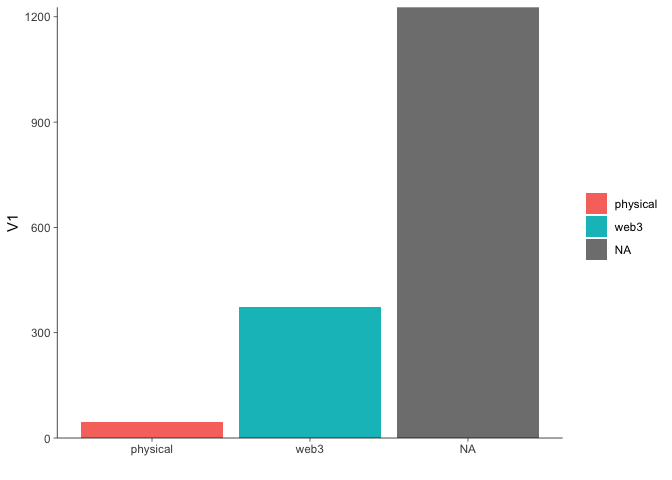
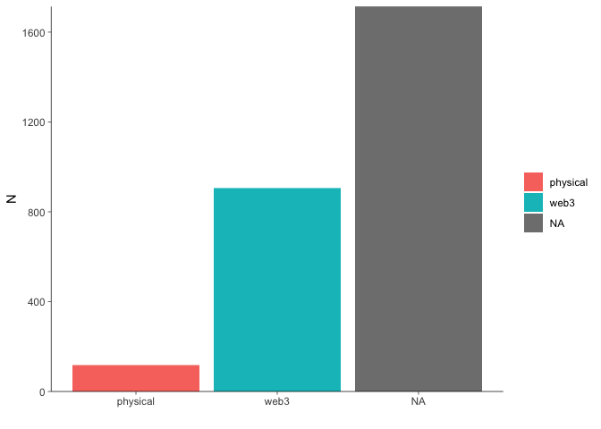

Freeriding the Metaverse
================

-   <a href="#data" id="toc-data">Data</a>
    -   <a href="#time-frames" id="toc-time-frames">Time frames</a>
    -   <a href="#brands" id="toc-brands">Brands</a>
    -   <a href="#refactor" id="toc-refactor">Refactor</a>
    -   <a href="#classification" id="toc-classification">Classification</a>
        -   <a href="#automated-heuristics" id="toc-automated-heuristics">Automated
            heuristics</a>
        -   <a href="#manual-inspection" id="toc-manual-inspection">Manual
            inspection</a>
-   <a href="#display" id="toc-display">Display</a>
    -   <a href="#tweets-by-domain" id="toc-tweets-by-domain">Tweets by
        domain</a>
        -   <a href="#number-of-tweets" id="toc-number-of-tweets">Number of
            Tweets</a>
        -   <a href="#number-of-likes" id="toc-number-of-likes">Number of Likes</a>
        -   <a href="#number-of-retweets" id="toc-number-of-retweets">Number of
            Retweets</a>
    -   <a href="#tweets-by-type" id="toc-tweets-by-type">Tweets by type</a>
        -   <a href="#number-of-tweets-1" id="toc-number-of-tweets-1">Number of
            Tweets</a>
        -   <a href="#number-of-likes-1" id="toc-number-of-likes-1">Number of
            Likes</a>
        -   <a href="#number-of-retweets-1" id="toc-number-of-retweets-1">Number of
            Retweets</a>
    -   <a href="#tweets-by-type-x-domain"
        id="toc-tweets-by-type-x-domain">Tweets by type x domain</a>

<!--
# To render the output to another directory, use the following lines in the YAML header
# Thanks https://stackoverflow.com/a/71826276
knit: (function(input, ...) {
    rmarkdown::render(
      input,
      output_dir = "../"
    )
  })
-->

``` r
options(stringsAsFactors = FALSE)
invisible(Sys.setlocale(category = "LC_ALL", locale = "C"))
set.seed(42)
```

``` r
# install.packages("pacman")
pacman::p_load(magrittr, data.table, stringr, lubridate, # overviewR,
               ggplot2, MetBrewer, knitr, fs, purrr,
               qdapRegex)
```

``` r
# ggplot layout
layout <- theme(panel.background = element_rect(fill = "transparent", color = NA),
                plot.background = element_rect(fill = "transparent", color = NA),
                panel.grid = element_blank(),
                panel.grid.major.y = element_blank(),
                legend.key = element_rect(fill = "transparent"),
                axis.line = element_line(size = 0.25),
                axis.ticks = element_line(size = 0.25),
                plot.caption = element_text(colour = "#555555"),
                legend.title = element_blank()
)

# color
# colors <- met.brewer(name="Tam",n=7,type="discrete")
cPrimary = "#00802F"
cSecondary = "#EB6969"
cInfo = "#FFF04B"
cDanger <- "#EB6969"
```

``` r
STARTDATE <- as.Date("2022-03-23")
ENDDATE   <- as.Date("2022-03-27")
```

Fast fashion is associated with waste, micro-plastics and a waste of
resources. [Digital fashion](https://www.netflix.com/watch/81197117)
promises to be superior to conventional (fast) fashion in all of these
regards as it allows consumers, for instance, to try on outfits
virtually such that they can better assess the clothing even before its
physical twins have been shipped. Another scenario is that it reduces
the consumption of physical fashion since the virtual products suffice
as a means to represent oneself in social media or the *metaverse*.

Along these lines several different stakeholders (including major brands
such as
[Forever21](https://twitter.com/Forever21/status/1507729045823234056)
and [Tommy
Hilfiger](https://twitter.com/TommyHilfiger/status/1507025541945245708))
started to experiment at the intersection of non fungible tokens (NFTs)
and fashion organizing the first ever *Metaverse Fashion Week* (MVFW)
online in March 2022. In addition, the 2022’s New York Fashion Week is
also accompanied by the [release of NFTs that match physical
products](https://www.forbes.com/sites/yolarobert1/2022/09/10/alo-yoga-debuts-its-first-ready-to-wear-collection-with-a-limited-edition-nft-at-new-york-fashion-week/).

Due to this recency, we scrape twitter data to better understand the key
stakeholders of the MVFW

# Data

We query data using [TWINT](https://github.com/twintproject/twint) and
the command line interface. Because twitter limits scrolls while
browsing a timeline, one can scrape about [3200 tweets per
query](https://github.com/twintproject/twint#limits-imposed-by-twitter).
For this reason, we run multiple queries and vary them in two
dimensions: the [time frames](#time-frames) as well as the [user
names](#brands).

## Time frames

The following queries scrape data from all users that either mentioned
`mvfw` or `metaverse fashion week` in different periods between
2022-02-23 and 2022-04-27. The results are stored in different `.csv`
files, loaded and row-binded to one data.table called `tmp`.

    twint -s "mvfw OR (Metaverse Fashion Week)" --since "2022-02-23" --until "2022-03-02" --lang "en" -o dev/mvfw/data/timeFrames/tmp1.csv --csv
    twint -s "mvfw OR (Metaverse Fashion Week)" --since "2022-03-02" --until "2022-03-09" --lang "en" -o dev/mvfw/data/timeFrames/tmp2.csv --csv
    twint -s "mvfw OR (Metaverse Fashion Week)" --since "2022-03-09" --until "2022-03-16" --lang "en" -o dev/mvfw/data/timeFrames/tmp3.csv --csv
    twint -s "mvfw OR (Metaverse Fashion Week)" --since "2022-03-16" --until "2022-03-23" --lang "en" -o dev/mvfw/data/timeFrames/tmp4.csv --csv
    twint -s "mvfw OR (Metaverse Fashion Week)" --since "2022-03-23" --until "2022-03-28" --lang "en" -o dev/mvfw/data/timeFrames/tmp5.csv --csv
    twint -s "mvfw OR (Metaverse Fashion Week)" --since "2022-03-28" --until "2022-04-04" --lang "en" -o dev/mvfw/data/timeFrames/tmp6.csv --csv
    twint -s "mvfw OR (Metaverse Fashion Week)" --since "2022-04-04" --until "2022-04-11" --lang "en" -o dev/mvfw/data/timeFrames/tmp7.csv --csv
    twint -s "mvfw OR (Metaverse Fashion Week)" --since "2022-04-11" --until "2022-04-18" --lang "en" -o dev/mvfw/data/timeFrames/tmp8.csv --csv
    twint -s "mvfw OR (Metaverse Fashion Week)" --since "2022-04-18" --until "2022-04-27" --lang "en" -o dev/mvfw/data/timeFrames/tmp9.csv --csv

``` r
data_path    <- "../data/timeFrames/"
file_paths   <- fs::dir_ls(path = data_path, glob = "*.csv")
object_names <- str_replace_all(string = file_paths,
                                pattern = paste0(data_path, "|\\.csv"),
                                replacement = "")
datasets     <- purrr::map(file_paths, read.csv, sep = "\t")
tmp <- data.table::rbindlist(l = datasets)
```

## Brands

In addition, we scrape data by usernames that represent brands we
identified synthesizing different news articles that covered the
event.[^1]

This yields a list of 27 usernames.[^2] Replace `[username]` by the
desired brand to scrape the corresponding tweets between 2022-02-23 and
2022-04-24. The resulting `.csv` files are then again loaded and
row-binded to one data.table called `brands`.

    twint -u [username] -s "mvfw OR (Metaverse Fashion Week)" --since "2022-02-23" --until "2022-04-24" --lang "en" -o dev/mvfw/data/brands/[username].csv --csv

<!--
=CONCAT("twint -u ", B2, " -s "'mvfw OR (Metaverse Fashion Week)" --since "'2022-02-23" --until "'2022-04-24" --lang "'en" -o dev/mvfw/data/brands/", B2, ".csv --csv")
-->

``` r
data_path   <- "../data/brands/"
file_paths  <- fs::dir_ls(path = data_path, glob = "*.csv")
datasets    <- purrr::map(file_paths, read.csv, sep = "\t")
brands <- data.table::rbindlist(l = datasets)
```

## Refactor

First, row-bind both data.tables, i.e. `brands` and `tmp`.

``` r
temp <- data.table::rbindlist(l = list(tmp, brands))
```

Then make sure to use a common character encoding, remove ULRs before
you remove duplicate tweets. Subsequently, add an ID, work on time and
date formats, etc.

``` r
# String clean up 
temp[, tweet := iconv(tweet, "latin1", "ASCII", sub = "")]
temp[, tweet := rm_url(tweet,                    # remove URLs
                      pattern = pastex("@rm_twitter_url", "@rm_url"))]

# subset english sample of UNIQUE tweets
en <- temp[language == "en"] %>% unique(by = "tweet")

# create distinc ID
en[, doc_id := .I]

# change date & time format
en[, created_at := str_sub(string = created_at,
                           start  = 1,
                           end    = 19) %>% ymd_hms()]
en[, date := ymd(date)]

# store mentions (@....)
en[, customMentions := str_extract_all(string = tweet,
                                       pattern = "@\\S+")]
en[customMentions == "character(0)", 
   customMentions := NA]
en[, nMentions := str_count(string = customMentions, pattern = "@")]
```

``` r
en[, timing := "after"]
en[date <= ENDDATE, timing := "during"]
en[date < STARTDATE, timing := "before"]
```

``` r
# re-arrange data for corpus
data <- en[date <= as.Date("2022-04-24"), # due to brands query
           .(doc_id,
             text = tweet,
             hashtags,
             cashtags,
             username,
             mentions,
             customMentions,
             nMentions,
             name,
             place,
             urls,
             photos,
             video,
             geo,
             timing,
             created_at,
             timezone,
             replies_count,
             retweets_count,
             likes_count,
             language,
             id,
             conversation_id,
             retweet_id)]
```

## Classification

Now, we’ll tag users such that they fall into different categories of
stakeholders. More precisely, I differentiate between two different
domains: `web3` and `fashion`. In addition, I also create a second
dimension – the `type` describing either `platform providers`,
`content creators`, who one could also describe as evangelists or
influencers, as well as `fashion creators`.

Note that:[^3]

-   conventional brands are described by
    `domain =="fashion" & type=="fashion creators"`.
-   fashion influencers are described by
    `domain =="fashion" & type=="content creators"`.
-   web3 evangelists are described by
    `domain =="web3" & type=="content creators"`.
-   digital fashion brands are described by
    `domain =="web3" & type=="fashion creators"`.

I’ve done the classification in a semi-automated way by focusing on the
`username`s.

### Automated heuristics

First, I apply regular expressions to tag web3 content creators.

``` r
data[str_detect(string = username,
                pattern = "nfts?|crypt|krypt|meta|block|coin"),
     `:=`(domain = "web3",
          type   = "content creators")]
```

Next, I use a similar approach to tag fashion and beauty related content
creators.

``` r
data[str_detect(string = username,
                pattern = "fashion|beauty|luxury"),
     `:=`(domain = "fashion",
          type   = "content creators")]
```

This yields many usernames that fall into neither of these categories.
This is where the manual part starts.

### Manual inspection

I display a table of the most relevant users, measured by the number of
likes they received for all their posts in our data. Subsequently, I
search the top 75 in twitter, read their description (or biography) as
well their posts in our data.

``` r
data[is.na(domain), 
     .(likes = sum(likes_count, na.rm = TRUE)),
     by = username][order(-likes)] %>% 
  head(75) %>%
  kable()
```

| username        | likes |
|:----------------|------:|
| bosonprotocol   |  4049 |
| decentraland    |  2382 |
| thalia          |   929 |
| dolcegabbana    |   855 |
| deadfellaz      |   822 |
| tommyhilfiger   |   666 |
| exclusible      |   662 |
| xrcouture       |   599 |
| thefabricant    |   468 |
| maghanmcd       |   408 |
| hoganbrand      |   395 |
| gossapegirl     |   383 |
| asian_mint      |   340 |
| canessadcl      |   308 |
| ericpi888       |   306 |
| etroofficial    |   298 |
| itskac          |   294 |
| threedium       |   260 |
| marc0matic      |   258 |
| antisecretsoci2 |   247 |
| auroboros_ltd   |   230 |
| esteelauder     |   228 |
| pangeadao       |   225 |
| cmnnewsofficial |   221 |
| diamondhandbag  |   209 |
| dragoncityio    |   202 |
| polygondressing |   191 |
| wirelyss        |   184 |
| cathyhackl      |   181 |
| \_mannyalves    |   170 |
| maryanadcl      |   160 |
| martinshibuya   |   156 |
| eagle_stephen\_ |   150 |
| 8sianmom        |   145 |
| realfaithtribe  |   143 |
| tokens_com      |   142 |
| the_vogu        |   141 |
| mrbathinape     |   140 |
| michi_todd      |   123 |
| bitpanda        |   117 |
| whiterabbitgate |   114 |
| brytehall       |   112 |
| universelle_io  |   109 |
| kcain1982       |   109 |
| borgetsebastien |   109 |
| nikkifuego92    |   106 |
| barbarakahn     |   101 |
| diviproject     |    98 |
| puma            |    92 |
| ziziverse       |    89 |
| shopcider       |    87 |
| astronotseth    |    85 |
| houseofdaw      |    84 |
| neuno_io        |    83 |
| yannakis_dcl    |    80 |
| xpozd_io        |    79 |
| tangpoko        |    79 |
| nicole29nixon   |    78 |
| thesevens_7     |    78 |
| 0xjoules        |    76 |
| teenybod        |    75 |
| stylexchange_io |    75 |
| celinatech      |    75 |
| enilev          |    74 |
| siddharthakur   |    74 |
| dressxcom       |    72 |
| pedroguez\_\_   |    71 |
| andywangnyla    |    70 |
| altavagroup     |    69 |
| ww_ventures     |    67 |
| davidcash888    |    66 |
| qdibs_eth       |    63 |
| realsophiarobot |    63 |
| parzival_kazuto |    61 |
| manadaiquiridcl |    61 |

Having reviewed all of them, I’ll classify them by hand.

``` r
# tag web3 freeriders
data[username %in% c("Deadfellaz", "gossapegirl", "asian_mint", "canessadcl",     # NAME WEB3 HERE!
                     "ericpi888", "itskac", "antisecretsoci2", "cmnnewsofficial",
                     "cathyhackl", # maybe too much fame to be a free rider?
                     "btctn", "_mannyalves", "maryanadcl", "martinshibuya",
                     "eagle_stephen_", "8sianmom", "tokens_com", "mrbathinape",
                     "michi_todd", "bitpanda", "brytehall", "universelle_io",
                     "kcain1982", "borgetsebastien", "barbarakahn", "diviproject",
                     "ziziverse", "astronotseth", "yannakis_dcl", "xpozd_io",
                     "tangpoko", "thesevens_7", "portionapp", "0xjoules",
                     "teenybod", "celinatech", "enilev", "siddharthakur",
                     "pedroguez__", "additionalrules", "media_diamante",
                     "altavagroup", "ww_ventures", "davidcash888", "move78studio",
                     "qdibs_eth", "realsophiarobot", "manadaiquiridcl",
                     "madamape", "decentralgames",
                     "deadfellaz" # not sure where to put these guys since they have some sort of cooperation
                     ), 
     `:=`(domain = "web3",
          type   = "content creators")]

# tag web3 x fashion
data[username %in% c("thefabricant", "xrcouture", "auroboros_ltd", "wirelyss",    # NAME WEB3 FASHION HERE!
                     "polygondressing", "the_vogu", "shopcider", "houseofdaw",
                     "neuno_io", "stylexchange_io", "parzival_kazuto"), 
     `:=`(domain = "web3",
          type   = "fashion creators")]

# tag content creators & media
data[username %in% c("thalia", "maghanmcd", "diamondhandbag", "realfaithtribe"   # NAME CONTENT CREATORS HERE!
                     ), 
     `:=`(domain = "fashion",
          type   = "content creators")]

# tag fashion brands
data[username %in% brands[, unique(username)], # NAME BRANDS HERE!
     `:=`(domain = "fashion",
          type   = "fashion creators")]

# tag platform- or ecosystem related users
data[username %in% c("decentraland", "bosonprotocol", "exclusible", "threedium",  # NAME PLATFORMS HERE!
                     "pangeadao", "dragoncityio", "whiterabbitgate"), 
     `:=`(domain = "web3",
          type   = "platform providers")]
```

The data contains 6.731 rows, each representing a tweet. Its columns
represent some IDs, meta information about URLs, retweets, etc. as well
as the tweets itself (from which I removed URLs using
`qdapRegex::rm_url()`).

``` r
data <- data[,
             .(doc_id,
               text,
               username,
               domain,
               type,
               timing,
               created_at,
               replies_count,
               retweets_count,
               likes_count,
               mentions,
               customMentions,
               nMentions,
               name,
               place,
               urls,
               photos,
               video,
               geo,
               timezone,
               language,
               id,
               conversation_id,
               retweet_id,
               hashtags,
               cashtags)]

save(data, file = "../data/processed/mvfw.RData")
```

# Display

Here is a list of the 25 users who received the most likes. Almost all
of them are centered around the web3 domain.

``` r
data[, .(likes = sum(likes_count, na.rm = TRUE)), by = c("username", "domain", "type")][order(-likes)] %>% head(25) %>% kable()
```

| username      | domain  | type               | likes |
|:--------------|:--------|:-------------------|------:|
| bosonprotocol | web3    | platform providers |  4049 |
| decentraland  | web3    | platform providers |  2382 |
| fanggangnft   | web3    | content creators   |  1317 |
| 8siannft      | web3    | content creators   |   956 |
| thalia        | fashion | content creators   |   929 |
| dolcegabbana  | fashion | fashion creators   |   855 |
| metaweartoken | web3    | content creators   |   854 |
| deadfellaz    | web3    | content creators   |   822 |
| tommyhilfiger | fashion | fashion creators   |   666 |
| exclusible    | web3    | platform providers |   662 |
| parcelnft     | web3    | content creators   |   655 |
| xrcouture     | web3    | fashion creators   |   599 |
| thefabricant  | web3    | fashion creators   |   468 |
| maghanmcd     | fashion | content creators   |   408 |
| hoganbrand    | fashion | fashion creators   |   395 |
| gossapegirl   | web3    | content creators   |   383 |
| themetakey    | web3    | content creators   |   379 |
| asian_mint    | web3    | content creators   |   340 |
| therebelsnft  | web3    | content creators   |   324 |
| canessadcl    | web3    | content creators   |   308 |
| ericpi888     | web3    | content creators   |   306 |
| etroofficial  | fashion | fashion creators   |   298 |
| itskac        | web3    | content creators   |   294 |
| threedium     | web3    | platform providers |   260 |
| marc0matic    | fashion | fashion creators   |   258 |

## Tweets by domain

### Number of Tweets

``` r
data[, .N, by = domain] %>% kable()
```

| domain  |    N |
|:--------|-----:|
| NA      | 1754 |
| web3    |  854 |
| fashion |  103 |

``` r
tmp <- data[, .N, by = c("username", "domain")]
ggplot(data = tmp,
       mapping = aes(x = domain, y = N, fill = domain)) +
  geom_bar(stat = "identity") +
  scale_y_continuous(limits = c(0, NA),
                     expand = c(0, NA)) +
  layout +
  labs(x = "")
```

<!-- -->

### Number of Likes

``` r
ggplot(data = data[, .(domain, likes_count)],
       mapping = aes(x = domain, y = likes_count, fill = domain)) +
  geom_bar(stat = "identity") +
  scale_y_continuous(limits = c(0, NA),
                     expand = c(0, NA)) +
  layout +
  labs(x = "")
```

<!-- -->

### Number of Retweets

``` r
ggplot(data = data[, .(domain, retweets_count)],
       mapping = aes(x = domain, y = retweets_count, fill = domain)) +
  geom_bar(stat = "identity") +
  scale_y_continuous(limits = c(0, NA),
                     expand = c(0, NA)) +
  layout +
  labs(x = "")
```

<!-- -->

## Tweets by type

### Number of Tweets

``` r
data[, .N, by = type] %>% kable()
```

| type               |    N |
|:-------------------|-----:|
| NA                 | 1754 |
| content creators   |  733 |
| fashion creators   |  130 |
| platform providers |   94 |

``` r
tmp <- data[, .N, by = c("username", "type")]
ggplot(data = tmp,
       mapping = aes(x = type, y = N, fill = type)) +
  geom_bar(stat = "identity") +
  scale_y_continuous(limits = c(0, NA),
                     expand = c(0, NA)) +
  layout +
  labs(x = "")
```

<!-- -->

### Number of Likes

``` r
ggplot(data = data[, .(type, likes_count)],
       mapping = aes(x = type, y = likes_count, fill = type)) +
  geom_bar(stat = "identity") +
  scale_y_continuous(limits = c(0, NA),
                     expand = c(0, NA)) +
  layout +
  labs(x = "")
```

<!-- -->

### Number of Retweets

``` r
ggplot(data = data[, .(type, retweets_count)],
       mapping = aes(x = type, y = retweets_count, fill = type)) +
  geom_bar(stat = "identity") +
  scale_y_continuous(limits = c(0, NA),
                     expand = c(0, NA)) +
  layout +
  labs(x = "")
```

<!-- -->

## Tweets by type x domain

``` r
data[, .(`Number of tweets` = .N), by = c("domain", "type")] %>% kable()
```

| domain  | type               | Number of tweets |
|:--------|:-------------------|-----------------:|
| NA      | NA                 |             1754 |
| web3    | content creators   |              670 |
| web3    | fashion creators   |               90 |
| web3    | platform providers |               94 |
| fashion | content creators   |               63 |
| fashion | fashion creators   |               40 |

``` r
data[, .(`Number of likes` = sum(likes_count)), by = c("domain", "type")] %>% kable()
```

| domain  | type               | Number of likes |
|:--------|:-------------------|----------------:|
| NA      | NA                 |            7079 |
| web3    | content creators   |           14184 |
| web3    | fashion creators   |            2203 |
| web3    | platform providers |            7894 |
| fashion | content creators   |            1835 |
| fashion | fashion creators   |            2924 |

``` r
data[, .(`Number of retweets` = sum(retweets_count)), by = c("domain", "type")] %>% kable()
```

| domain  | type               | Number of retweets |
|:--------|:-------------------|-------------------:|
| NA      | NA                 |               1588 |
| web3    | content creators   |               4866 |
| web3    | fashion creators   |                909 |
| web3    | platform providers |               1976 |
| fashion | content creators   |                517 |
| fashion | fashion creators   |                825 |

[^1]: e.g. [1](https://www.voguebusiness.com/technology/metaverse-fashion-week-the-hits-and-misses),
    [2](https://www.vogue.com/article/metaverse-fashion-week-decentraland),
    [3](https://decentraland.org/blog/announcements/metaverse-fashion-week-is-here/#flagship-stores),
    [4](https://www.lifestyleasia.com/ind/gear/tech/highlights-from-2022-metaverse-fashion-week/)
    and [5](https://metaversefashionweek.com/)

[^2]: tommyhilfiger, forever21, esteelauder, KarlLagerfeld, McQueen,
    dkny, dressxcom, dolcegabbana, EtroOfficial, FranckMuller,
    Selfridges, Bulova, PacoRabanne, ArtistVasarely, PUMA, PerryEllis,
    Fred_Segal, VAULTswiss, MissJAlexander, marc0matic, Charles_Keith,
    priveporter, philipp_plein, ElieSaabWorld, HoganBrand, IOCNFTs,
    dundaslondon

[^3]: Note to myself: create table, if two dimensions are really
    required.
