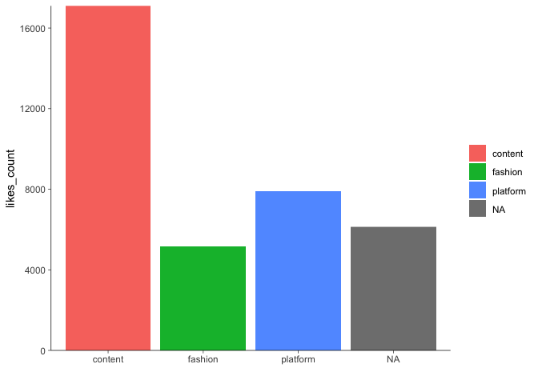
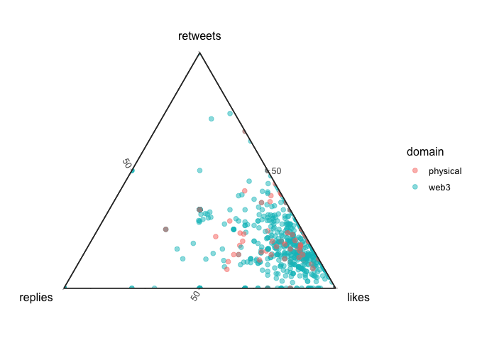
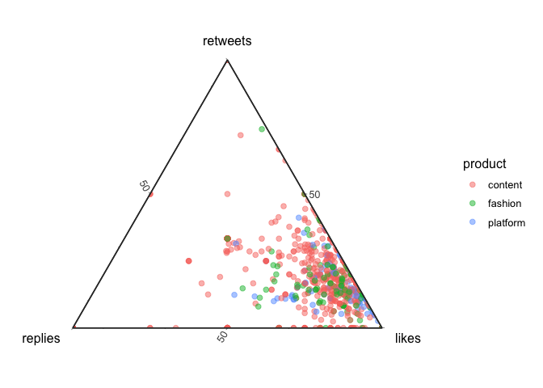
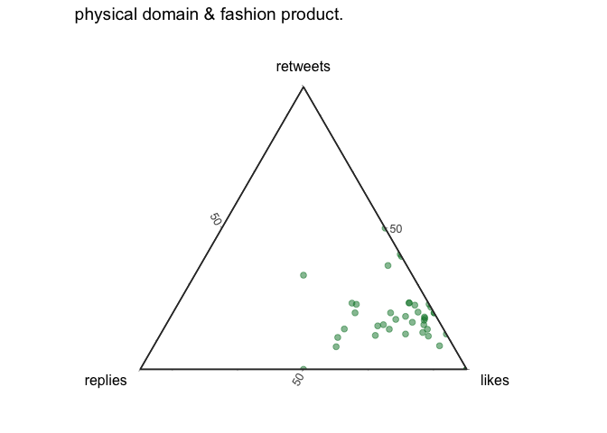
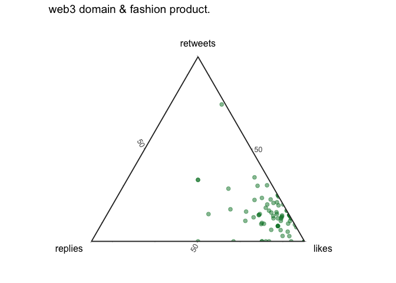
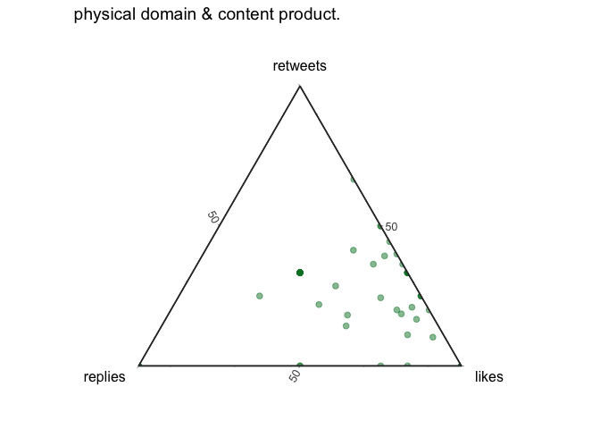
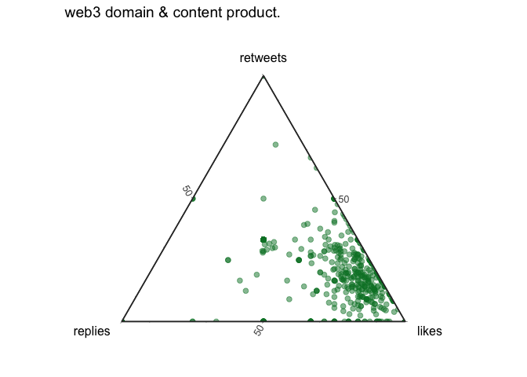

Freeriding the Metaverse
================

<!--
# To render the output to another directory, use the following lines in the YAML header
# Thanks https://stackoverflow.com/a/71826276
knit: (function(input, ...) {
    rmarkdown::render(
      input,
      output_dir = "../"
    )
  })
-->

# Contents

The second section shows **[how we processed the data](#data)** while
the third section contains a brief **[exploratory
analysis](#exploration)**. I also show **[random samples of tweets by
domain](#examplary-tweets)** and present **[Ternary
plots](#ternary-plot)** that visualize engagement ratios.

------------------------------------------------------------------------

*(The following four code chunks set up the document.)*

``` r
options(stringsAsFactors = FALSE)
invisible(Sys.setlocale(category = "LC_ALL", locale = "C"))
set.seed(42)
```

``` r
# install.packages("pacman")
pacman::p_load(magrittr, data.table, stringr, lubridate, # overviewR,
               ggplot2, ggtern, MetBrewer, knitr, fs, purrr,
               qdapRegex)
```

``` r
# ggplot layout
layout <- theme(panel.background = element_rect(fill = "transparent", color = NA),
                plot.background = element_rect(fill = "transparent", color = NA),
                panel.grid = element_blank(),
                panel.grid.major.y = element_blank(),
                legend.key = element_rect(fill = "transparent"),
                axis.line = element_line(size = 0.25),
                axis.ticks = element_line(size = 0.25),
                plot.caption = element_text(colour = "#555555"),
                legend.title = element_blank()
)

# color
# colors <- met.brewer(name="Tam",n=7,product="discrete")
cPrimary = "#00802F"
cSecondary = "#EB6969"
cInfo = "#FFF04B"
cDanger <- "#EB6969"
```

``` r
STARTDATE <- as.Date("2022-03-23")
ENDDATE   <- as.Date("2022-03-27")
```

# Data

We query data using [TWINT](https://github.com/twintproject/twint) and
the command line interface. Because twitter limits scrolls while
browsing a timeline, one can scrape about [3200 tweets per
query](https://github.com/twintproject/twint#limits-imposed-by-twitter).
For this reason, we run multiple queries and vary them in two
dimensions: the [time frames](#time-frames) as well as the [user
names](#brands).

## Time frames

The following queries scrape data from all users that either mentioned
`mvfw` or `metaverse fashion week` in different periods between
2022-02-23 and 2022-04-27. The results are stored in different `.csv`
files, loaded and row-binded to one data.table called `tmp`.

    twint -s "mvfw OR (Metaverse Fashion Week)" --since "2022-02-23" --until "2022-03-02" --lang "en" -o dev/mvfw/data/timeFrames/tmp1.csv --csv
    twint -s "mvfw OR (Metaverse Fashion Week)" --since "2022-03-02" --until "2022-03-09" --lang "en" -o dev/mvfw/data/timeFrames/tmp2.csv --csv
    twint -s "mvfw OR (Metaverse Fashion Week)" --since "2022-03-09" --until "2022-03-16" --lang "en" -o dev/mvfw/data/timeFrames/tmp3.csv --csv
    twint -s "mvfw OR (Metaverse Fashion Week)" --since "2022-03-16" --until "2022-03-23" --lang "en" -o dev/mvfw/data/timeFrames/tmp4.csv --csv
    twint -s "mvfw OR (Metaverse Fashion Week)" --since "2022-03-23" --until "2022-03-28" --lang "en" -o dev/mvfw/data/timeFrames/tmp5.csv --csv
    twint -s "mvfw OR (Metaverse Fashion Week)" --since "2022-03-28" --until "2022-04-04" --lang "en" -o dev/mvfw/data/timeFrames/tmp6.csv --csv
    twint -s "mvfw OR (Metaverse Fashion Week)" --since "2022-04-04" --until "2022-04-11" --lang "en" -o dev/mvfw/data/timeFrames/tmp7.csv --csv
    twint -s "mvfw OR (Metaverse Fashion Week)" --since "2022-04-11" --until "2022-04-18" --lang "en" -o dev/mvfw/data/timeFrames/tmp8.csv --csv
    twint -s "mvfw OR (Metaverse Fashion Week)" --since "2022-04-18" --until "2022-04-27" --lang "en" -o dev/mvfw/data/timeFrames/tmp9.csv --csv

``` r
data_path    <- "../data/timeFrames/"
file_paths   <- fs::dir_ls(path = data_path, glob = "*.csv")
object_names <- str_replace_all(string = file_paths,
                                pattern = paste0(data_path, "|\\.csv"),
                                replacement = "")
datasets     <- purrr::map(file_paths, read.csv, sep = "\t")
tmp <- data.table::rbindlist(l = datasets)
```

## Brands

In addition, we scrape data by usernames that represent brands we
identified synthesizing different news articles that covered the
event.[^1]

This yields a list of 27 usernames.[^2] Replace `[username]` by the
desired brand to scrape the corresponding tweets between 2022-02-23 and
2022-04-24. The resulting `.csv` files are then again loaded and
row-binded to one data.table called `brands`.

    twint -u [username] -s "mvfw OR (Metaverse Fashion Week)" --since "2022-02-23" --until "2022-04-24" --lang "en" -o dev/mvfw/data/brands/[username].csv --csv

<!--
=CONCAT("twint -u ", B2, " -s "'mvfw OR (Metaverse Fashion Week)" --since "'2022-02-23" --until "'2022-04-24" --lang "'en" -o dev/mvfw/data/brands/", B2, ".csv --csv")
-->

``` r
data_path   <- "../data/brands/"
file_paths  <- fs::dir_ls(path = data_path, glob = "*.csv")
datasets    <- purrr::map(file_paths, read.csv, sep = "\t")
brands <- data.table::rbindlist(l = datasets)
```

## Refactor

First, row-bind both data.tables, i.e. `brands` and `tmp`.

``` r
temp <- data.table::rbindlist(l = list(tmp, brands))
```

Then make sure to use a common character encoding, remove ULRs before
you remove duplicate tweets. Subsequently, add an ID, work on time and
date formats, etc.

``` r
# String clean up 
temp[, tweet := iconv(tweet, "latin1", "ASCII", sub = "")]
temp[, tweet := rm_url(tweet,                    # remove URLs
                      pattern = pastex("@rm_twitter_url", "@rm_url"))]

# subset english sample of UNIQUE tweets
en <- temp[language == "en"] %>% unique(by = "tweet")

# create distinc ID
en[, doc_id := .I]

# change date & time format
en[, created_at := str_sub(string = created_at,
                           start  = 1,
                           end    = 19) %>% ymd_hms()]
en[, date := ymd(date)]

# store mentions (@....)
en[, customMentions := str_extract_all(string = tweet,
                                       pattern = "@\\S+")]
en[customMentions == "character(0)", 
   customMentions := NA]
en[, nMentions := str_count(string = customMentions, pattern = "@")]
```

``` r
en[, timing := "after"]
en[date <= ENDDATE, timing := "during"]
en[date < STARTDATE, timing := "before"]

en[, timing := factor(timing,
                      ordered = TRUE,
                      levels  = c("before", "during", "after"))]
```

``` r
# re-arrange data for corpus
data <- en[date <= as.Date("2022-04-24"), # due to brands query
           .(doc_id,
             text = tweet,
             hashtags,
             cashtags,
             username,
             mentions,
             customMentions,
             nMentions,
             name,
             place,
             urls,
             photos,
             video,
             geo,
             timing,
             date,
             created_at,
             timezone,
             replies_count,
             retweets_count,
             likes_count,
             language,
             id,
             conversation_id,
             retweet_id)]
```

## Classification

Now, we’ll tag users such that they fall into different categories of
stakeholders. More precisely, I differentiate between two different
domains: `web3` and `physical`. In addition, I also create a second
dimension – the `product` describing either `platform`, `content`, who
one could also describe as evangelists or influencers, as well as
`fashion` (meaning conventional or digital fashion).

To better visualize the classification, take a look at the following
table where the rows represent the domains and the columns represent the
product these stakeholders create (fashion, content, the platform
itself).

|              | Fashion                    | Content    | Platform          |
|--------------|----------------------------|------------|-------------------|
| **Physical** | conventional fashion brand | influencer | \-                |
| **Web3**     | digital fashion brand      | evangelist | platform provider |

I’ve done the classification in a semi-automated way by focusing on the
`username`s.

### Automated heuristics

First, I apply regular expressions to tag web3 content.

``` r
data[str_detect(string = username,
                pattern = "nfts?|crypt|krypt|meta|block|coin"),
     `:=`(domain = "web3",
          product   = "content")]
```

Next, I use a similar approach to tag fashion and beauty related
content.

``` r
data[str_detect(string = username,
                pattern = "fashion|beauty|luxury"),
     `:=`(domain = "physical",
          product   = "content")]
```

This yields many usernames that fall into neither of these categories.
This is where the manual part starts.

### Manual inspection

The following figure shows a density plot that illustrates the number of
likes a user received.[^3]

``` r
tmp <- data[is.na(domain), 
     .(likes = sum(likes_count, na.rm = TRUE)),
     by = username][order(-likes)]

ggplot(data = tmp[likes > 0 & likes < 1000],
       mapping = aes(x = likes)) +
  # geom_histogram(fill = cPrimary, binwidth = 5) +
  geom_density(fill = cPrimary, alpha = 0.66, col = cPrimary) +
  scale_y_continuous(limits = c(0, NA),
                     expand = c(0, NA)) +
  layout
```

<!-- -->

``` r
known   <- tmp[1:100, sum(likes)]
overall <- tmp[, sum(likes)]
share   <- round(100*known/overall)
```

Next, I display a table of the 100 most relevant users, measured by the
number of likes they received for all their posts in our data. These 100
users account for 80% of the likes we observe in our data that are not
yet categorized by the automatic approach outlined
[above](#automated-heuristics).

``` r
tmp %>% 
  head(100) %>%
  kable()
```

| username        | likes |
|:----------------|------:|
| bosonprotocol   |  4049 |
| decentraland    |  2382 |
| thalia          |   929 |
| dolcegabbana    |   855 |
| deadfellaz      |   822 |
| tommyhilfiger   |   666 |
| exclusible      |   662 |
| xrcouture       |   599 |
| thefabricant    |   468 |
| maghanmcd       |   408 |
| hoganbrand      |   395 |
| gossapegirl     |   383 |
| asian_mint      |   340 |
| canessadcl      |   308 |
| ericpi888       |   306 |
| etroofficial    |   298 |
| itskac          |   294 |
| threedium       |   260 |
| marc0matic      |   258 |
| antisecretsoci2 |   247 |
| auroboros_ltd   |   230 |
| esteelauder     |   228 |
| pangeadao       |   225 |
| cmnnewsofficial |   221 |
| diamondhandbag  |   209 |
| dragoncityio    |   202 |
| polygondressing |   191 |
| wirelyss        |   184 |
| cathyhackl      |   181 |
| \_mannyalves    |   170 |
| maryanadcl      |   160 |
| martinshibuya   |   156 |
| eagle_stephen\_ |   150 |
| 8sianmom        |   145 |
| realfaithtribe  |   143 |
| tokens_com      |   142 |
| the_vogu        |   141 |
| mrbathinape     |   140 |
| michi_todd      |   123 |
| bitpanda        |   117 |
| whiterabbitgate |   114 |
| brytehall       |   112 |
| universelle_io  |   109 |
| kcain1982       |   109 |
| borgetsebastien |   109 |
| nikkifuego92    |   106 |
| barbarakahn     |   101 |
| diviproject     |    98 |
| puma            |    92 |
| ziziverse       |    89 |
| shopcider       |    87 |
| astronotseth    |    85 |
| houseofdaw      |    84 |
| neuno_io        |    83 |
| yannakis_dcl    |    80 |
| xpozd_io        |    79 |
| tangpoko        |    79 |
| nicole29nixon   |    78 |
| thesevens_7     |    78 |
| 0xjoules        |    76 |
| teenybod        |    75 |
| stylexchange_io |    75 |
| celinatech      |    75 |
| enilev          |    74 |
| siddharthakur   |    74 |
| dressxcom       |    72 |
| pedroguez\_\_   |    71 |
| andywangnyla    |    70 |
| altavagroup     |    69 |
| ww_ventures     |    67 |
| davidcash888    |    66 |
| qdibs_eth       |    63 |
| realsophiarobot |    63 |
| parzival_kazuto |    61 |
| manadaiquiridcl |    61 |
| madamape        |    61 |
| decentralgames  |    61 |
| degenitamar     |    59 |
| reuters         |    59 |
| projectmediahq  |    58 |
| dcljasonx       |    58 |
| forbeslife      |    57 |
| mutani_io       |    56 |
| 0xquiksilver    |    55 |
| reginaturbina   |    54 |
| jonassft        |    53 |
| bitski          |    53 |
| jtv\_\_\_\_     |    52 |
| forbes          |    52 |
| lingxing_dcl    |    51 |
| soultrydubs     |    51 |
| dogmandcl       |    50 |
| knownorigin_io  |    50 |
| danitpeleg3d    |    50 |
| voguebusiness   |    49 |
| survive_p2e     |    49 |
| mgh_dao         |    49 |
| serenaelis\_    |    47 |
| koryptostylist  |    47 |
| voguesingapore  |    47 |

Subsequently, I search the top 100 users in twitter using a web browser,
read their description (or biography) as well their posts in our data.
Having reviewed all of them, I’ll classify them by hand.

``` r
# tag web3 freeriders
data[username %in% c("Deadfellaz", "gossapegirl", "asian_mint", "canessadcl",     # NAME WEB3 HERE!
                     "ericpi888", "itskac", "antisecretsoci2", "cmnnewsofficial",
                     "cathyhackl", # maybe too much fame to be a free rider?
                     "btctn", "_mannyalves", "maryanadcl", "martinshibuya",
                     "eagle_stephen_", "8sianmom", "tokens_com", "mrbathinape",
                     "michi_todd", "bitpanda", "brytehall", "universelle_io",
                     "kcain1982", "borgetsebastien", "barbarakahn", "diviproject",
                     "ziziverse", "astronotseth", "yannakis_dcl", "xpozd_io",
                     "tangpoko", "thesevens_7", "portionapp", "0xjoules",
                     "teenybod", "celinatech", "enilev", "siddharthakur",
                     "pedroguez__", "additionalrules", "media_diamante",
                     "altavagroup", "ww_ventures", "davidcash888", "move78studio",
                     "qdibs_eth", "realsophiarobot", "manadaiquiridcl",
                     "madamape", "decentralgames", "projectmediahq", "dcljasonx",
                     "mutani_io", "0xquiksilver", "reginaturbina", "jtv____",
                     "dogmandcl", "soultrydubs", "lingxing_dcl", "knownorigin_io",
                     "danitpeleg3d", "survive_p2e", "mgh_dao", "serenaelis_",
                     "koryptostylist",
                     "deadfellaz" # not sure where to put these guys since they have some sort of cooperation
                     ), 
     `:=`(domain = "web3",
          product   = "content")]

# tag web3 x fashion
data[username %in% c("thefabricant", "xrcouture", "auroboros_ltd", "wirelyss",    # NAME WEB3 FASHION HERE!
                     "polygondressing", "the_vogu", "shopcider", "houseofdaw",
                     "neuno_io", "stylexchange_io", "parzival_kazuto", "bitski"), 
     `:=`(domain = "web3",
          product   = "fashion")]

# tag content & media
data[username %in% c("thalia", "maghanmcd", "diamondhandbag", "realfaithtribe"   # NAME content HERE!
                     ), 
     `:=`(domain = "physical",
          product   = "content")]

# tag fashion brands
data[username %in% brands[, unique(username)], # NAME BRANDS HERE!
     `:=`(domain = "physical",
          product   = "fashion")]

# tag platform- or ecosystem related users
data[username %in% c("decentraland", "bosonprotocol", "exclusible", "threedium",  # NAME PLATFORMS HERE!
                     "pangeadao", "dragoncityio", "whiterabbitgate"), 
     `:=`(domain = "web3",
          product   = "platform")]
```

The data contains 1.320 rows, each representing a tweet. Its columns
represent some IDs, meta information about URLs, retweets, etc. as well
as the tweets itself (from which I removed URLs using
`qdapRegex::rm_url()`).

``` r
data <- data[,
             .(doc_id,
               text,
               username,
               domain,
               product,
               timing,
               date,
               created_at,
               replies_count,
               retweets_count,
               likes_count,
               mentions,
               customMentions,
               nMentions,
               name,
               place,
               urls,
               photos,
               video,
               geo,
               timezone,
               language,
               id,
               conversation_id,
               retweet_id,
               hashtags,
               cashtags)]

save(data, file = "../data/processed/mvfw.RData")
```

# Exploration

Here is a list of the 25 users who received the most likes. Almost all
of them are centered around the web3 domain.

``` r
data[, .(likes = sum(likes_count, na.rm = TRUE)), by = c("username", "domain", "product")][order(-likes)] %>% head(25) %>% kable()
```

| username      | domain   | product  | likes |
|:--------------|:---------|:---------|------:|
| bosonprotocol | web3     | platform |  4049 |
| decentraland  | web3     | platform |  2382 |
| fanggangnft   | web3     | content  |  1317 |
| 8siannft      | web3     | content  |   956 |
| thalia        | physical | content  |   929 |
| dolcegabbana  | physical | fashion  |   855 |
| metaweartoken | web3     | content  |   854 |
| deadfellaz    | web3     | content  |   822 |
| tommyhilfiger | physical | fashion  |   666 |
| exclusible    | web3     | platform |   662 |
| parcelnft     | web3     | content  |   655 |
| xrcouture     | web3     | fashion  |   599 |
| thefabricant  | web3     | fashion  |   468 |
| maghanmcd     | physical | content  |   408 |
| hoganbrand    | physical | fashion  |   395 |
| gossapegirl   | web3     | content  |   383 |
| themetakey    | web3     | content  |   379 |
| asian_mint    | web3     | content  |   340 |
| therebelsnft  | web3     | content  |   324 |
| canessadcl    | web3     | content  |   308 |
| ericpi888     | web3     | content  |   306 |
| etroofficial  | physical | fashion  |   298 |
| itskac        | web3     | content  |   294 |
| threedium     | web3     | platform |   260 |
| marc0matic    | physical | fashion  |   258 |

## Tweets by domain

### Number of Tweets

``` r
data[, .N, by = domain] %>% kable()
```

| domain   |    N |
|:---------|-----:|
| NA       | 1707 |
| web3     |  901 |
| physical |  103 |

``` r
tmp <- data[, .N, by = c("username", "domain")]
ggplot(data = tmp,
       mapping = aes(x = domain, y = N, fill = domain)) +
  geom_bar(stat = "identity") +
  scale_y_continuous(limits = c(0, NA),
                     expand = c(0, NA)) +
  layout +
  labs(x = "")
```

<!-- -->

### Number of Likes

``` r
ggplot(data = data[, .(domain, likes_count)],
       mapping = aes(x = domain, y = likes_count, fill = domain)) +
  geom_bar(stat = "identity") +
  scale_y_continuous(limits = c(0, NA),
                     expand = c(0, NA)) +
  layout +
  labs(x = "")
```

<!-- -->

### Number of Retweets

``` r
ggplot(data = data[, .(domain, retweets_count)],
       mapping = aes(x = domain, y = retweets_count, fill = domain)) +
  geom_bar(stat = "identity") +
  scale_y_continuous(limits = c(0, NA),
                     expand = c(0, NA)) +
  layout +
  labs(x = "")
```

<!-- -->

## Tweets by product

### Number of Tweets

``` r
data[, .N, by = product] %>% kable()
```

| product  |    N |
|:---------|-----:|
| NA       | 1707 |
| content  |  777 |
| fashion  |  133 |
| platform |   94 |

``` r
tmp <- data[, .N, by = c("username", "product")]
ggplot(data = tmp,
       mapping = aes(x = product, y = N, fill = product)) +
  geom_bar(stat = "identity") +
  scale_y_continuous(limits = c(0, NA),
                     expand = c(0, NA)) +
  layout +
  labs(x = "")
```

<!-- -->

### Number of Likes

``` r
ggplot(data = data[, .(product, likes_count)],
       mapping = aes(x = product, y = likes_count, fill = product)) +
  geom_bar(stat = "identity") +
  scale_y_continuous(limits = c(0, NA),
                     expand = c(0, NA)) +
  layout +
  labs(x = "")
```

<!-- -->

### Number of Retweets

``` r
ggplot(data = data[, .(product, retweets_count)],
       mapping = aes(x = product, y = retweets_count, fill = product)) +
  geom_bar(stat = "identity") +
  scale_y_continuous(limits = c(0, NA),
                     expand = c(0, NA)) +
  layout +
  labs(x = "")
```

<!-- -->

## Tweets by product x domain

``` r
data[, .(`Number of tweets` = .N), by = c("domain", "product")] %>% kable()
```

| domain   | product  | Number of tweets |
|:---------|:---------|-----------------:|
| NA       | NA       |             1707 |
| web3     | content  |              714 |
| web3     | fashion  |               93 |
| web3     | platform |               94 |
| physical | content  |               63 |
| physical | fashion  |               40 |

``` r
data[, .(`Number of likes` = sum(likes_count)), by = c("domain", "product")] %>% kable()
```

| domain   | product  | Number of likes |
|:---------|:---------|----------------:|
| NA       | NA       |            6249 |
| web3     | content  |           14961 |
| web3     | fashion  |            2256 |
| web3     | platform |            7894 |
| physical | content  |            1835 |
| physical | fashion  |            2924 |

``` r
data[, .(`Number of retweets` = sum(retweets_count)), by = c("domain", "product")] %>% kable()
```

| domain   | product  | Number of retweets |
|:---------|:---------|-------------------:|
| NA       | NA       |               1389 |
| web3     | content  |               5057 |
| web3     | fashion  |                917 |
| web3     | platform |               1976 |
| physical | content  |                517 |
| physical | fashion  |                825 |

# Timing

## Timing x domain

How much was posted before, during and after the MVFW?

``` r
tmp <- data[!is.na(domain), .(N = .N), by = c("timing", "domain")][order(domain)]
tmp[, sum := sum(N), by = domain]
tmp[, share := paste0(round(100*N/sum), "%")]
tmp %>% kable()
```

| timing | domain   |   N | sum | share |
|:-------|:---------|----:|----:|:------|
| before | physical |  42 | 103 | 41%   |
| during | physical |  39 | 103 | 38%   |
| after  | physical |  22 | 103 | 21%   |
| before | web3     | 506 | 901 | 56%   |
| during | web3     | 210 | 901 | 23%   |
| after  | web3     | 185 | 901 | 21%   |

Even though we queried the data such that the duration of the time
`before` is exactly as long as the duration of the time `after` (+/-28
days), we count less tweets in both domains (web3 as well as fashion)
posted after the MVFW took place.

``` r
data[, min(date)] - STARTDATE
data[, max(date)] - ENDDATE
```

The same holds true for the number of likes received…

``` r
tmp <- data[!is.na(domain), .(N = sum(likes_count)), by = c("timing", "domain")][order(domain)]
tmp[, sum := sum(N), by = domain]
tmp[, share := paste0(round(100*N/sum), "%")]
tmp %>% kable()
```

| timing | domain   |     N |   sum | share |
|:-------|:---------|------:|------:|:------|
| before | physical |   943 |  4759 | 20%   |
| during | physical |  3660 |  4759 | 77%   |
| after  | physical |   156 |  4759 | 3%    |
| before | web3     | 16224 | 25111 | 65%   |
| during | web3     |  5952 | 25111 | 24%   |
| after  | web3     |  2935 | 25111 | 12%   |

…as well as for the number of retweets.

``` r
tmp <- data[!is.na(domain), .(N = sum(retweets_count)), by = c("timing", "domain")][order(domain)]
tmp[, sum := sum(N), by = domain]
tmp[, share := paste0(round(100*N/sum), "%")]
tmp %>% kable()
```

| timing | domain   |    N |  sum | share |
|:-------|:---------|-----:|-----:|:------|
| before | physical |  317 | 1342 | 24%   |
| during | physical |  932 | 1342 | 69%   |
| after  | physical |   93 | 1342 | 7%    |
| before | web3     | 5240 | 7950 | 66%   |
| during | web3     | 1677 | 7950 | 21%   |
| after  | web3     | 1033 | 7950 | 13%   |

However, both of these engagement metrics (`likes_count` and
`retweets_count`) show different patterns across domains. The web3
domain triggered by far the most engagement before the event, while the
fashion domain received the most attention during the event (on the
basis of a comparable amount of tweets).

## Timing x product

How much was posted before, during and after the MVFW?

``` r
tmp <- data[!is.na(domain), .(N = .N), by = c("timing", "product")][order(product)]
tmp[, sum := sum(N), by = product]
tmp[, share := paste0(round(100*N/sum), "%")]
tmp %>% kable()
```

| timing | product  |   N | sum | share |
|:-------|:---------|----:|----:|:------|
| before | content  | 423 | 777 | 54%   |
| during | content  | 166 | 777 | 21%   |
| after  | content  | 188 | 777 | 24%   |
| before | fashion  |  60 | 133 | 45%   |
| during | fashion  |  62 | 133 | 47%   |
| after  | fashion  |  11 | 133 | 8%    |
| before | platform |  65 |  94 | 69%   |
| after  | platform |   8 |  94 | 9%    |
| during | platform |  21 |  94 | 22%   |

# Examplary Tweets

## Fashion

``` r
data[domain == "physical" & product == "fashion", .(text, username)][sample(.N, 15)] %>% kable()
```

| text                                                                                                                                                                                                                                                                                      | username      |
|:------------------------------------------------------------------------------------------------------------------------------------------------------------------------------------------------------------------------------------------------------------------------------------------|:--------------|
| We are proud to present an exclusive collection of NFT Wearables created just for the metaverse! DECENTRALAND FASHION WEEK Did you join our launch party?! @meta_archs                                                                                                                    | forever21     |
| Dolce&Gabbana will showcase at Metaverse Fashion Week in @Decentraland w/ @UNXD_NFT We’ve designed a bespoke collection for the occasion, which will ONLY be available for DGFamily holders 2 looks revealed this week! WL:                                                               | dolcegabbana  |
| DKNY is officially in the metaverse! Join us at the metaverses first ever fashion week @decentraland. \#MVFW                                                                                                                                                                              | dkny          |
| The Liquid Paisley collection straight from the catwalk during the first Metaverse Fashion Week in @decentraland in partnership with @UNXD_NFT. \#MVFW                                                                                                                                    | etroofficial  |
| Were excited to share the news! We are the only beauty brand at @decentralands \#MetaverseFashionWeek! Our experience will feature a wearable NFT created by artist & identity designer @thealexbox! Learn more: + @voguebusiness \#MVFW                                                  | esteelauder   |
| Are you sure you have completed you outfit for tonight’s party? Come and claim your \#HoganX wearables following the link below \#MVFW @decentraland @exclusible @VegasCityDCL                                                                                                            | hoganbrand    |
| Metaverse Fashion Week is almost here. Spectators will have the chance to virtually shop at our Perry Ellis America store located on Rarible Street for iconic looks from our spring summer 22’ collection. Limited amounts of wearables available. See you Thursday! \#PerryEllisAmerica | perryellis    |
| Stand a chance to win our limited-edition mini Koa bag by posting a picture of your avatar at the CHARLES & KEITH pop-up booth to your Instagram Story. Other terms and conditions apply. Find out more: \#MetaCharlesKeith \#MVFW \#Decentraland                                         | charles_keith |
| We are excited to join @decentraland in the very first \#Metaverse \#fashionweek More coming soon                                                                                                                                                                                         | vaultswiss    |
| The Marc-O-Matic Store is live in @decentraland for \#Metaverse Fashion Week Big shout out to Decentraland team, @rarible @themetakey For this opportunity. Store Located: -49,69 \#MVFW22 \#nfts \#fashion \#3d \#NFTCommumity \#MATIC                                                   | marc0matic    |
| Thrilled to be part of the first Metaverse Fashion Week on \#Decentraland. \#Savethedate March, 25th at 4pm CET. \#MVFW                                                                                                                                                                   | etroofficial  |
| The first-ever Etro \#Metaverse fashion show is around the corner. Join us tomorrow at 4pm CET in \#Decentraland \> \#MVFW                                                                                                                                                                | etroofficial  |
| Getting ready for the \#HoganX afterparty at @decentraland Here’s a preview of the stage! Come and join us tomorrow, Saturday March 26th, at 7PM GMT Follow the link to discover more @exclusible @BosonProtocol @BrawHaus @VegasCityDCL \#MVFW                                           | hoganbrand    |
| \#DolceGabbana showcases at the First Metaverse Virtual Fashion Week hosted by @decentraland in partnership with @unxd_nft. Enter the metaverse and explore the Dolce&Gabbana pop-up at                                                                                                   | dolcegabbana  |
| Have you heard the news? We are excited to share that we are the only beauty brand at @decentralands \#MetaverseFashionWeek! Our experience includes a wearable NFT, inspired by our iconic \#AdvancedNightRepair Serum. Learn more: + @wwd \#MVFW                                        | esteelauder   |

``` r
data[domain == "physical" & product == "content", .(text, username)][sample(.N, 15)] %>% kable()
```

| text                                                                                                                                                                                                                                                                               | username        |
|:-----------------------------------------------------------------------------------------------------------------------------------------------------------------------------------------------------------------------------------------------------------------------------------|:----------------|
| Tommy Hilfiger participates in Metaverse Fashion Week \#TommyHilfiger \#Tommy \#metaverse \#meta \#fashionweek \#digitalfashion                                                                                                                                                    | fashionabc\_    |
| How the metaverse influenced New York Fashion Week via @voguebusiness                                                                                                                                                                                                              | arentfoxfashion |
| any brand attending metaverse fashion week is sooo desperate for meme culture attention, its embarrassing                                                                                                                                                                          | fashionblebitch |
| We’ve created these 2 wearable bags for Metaverse Fashion Week. Dragon Bag or Banana Bag? Which one do you want to WIN? 1. Comment to tell us 2. Tag 3 friends for extra votes                                                                                                     | diamondhandbag  |
| @LUCII_UV what kind of low Polly count are we talking about when designing for @decentraland \#mvfw?                                                                                                                                                                               | 360fashion      |
| ————————————– : \#fashion \#celebrities \#news \#tipsoffashion \#metaverse \#fashionweek \#upcoming                                                                                                                                                                                | shoperfashion   |
| Alpha DiamondHandBag x @gossapegirl are featured on the runways of Metaverse Fashion Week on March 24 We’re the FIRST EVER Handbag Wearable available on @Decentraland WIN 1 of 5 DiamondHandBag wearables: ENTER RT, Like & Tag 3 Friends \#MVFW \#Gossapegirls                   | diamondhandbag  |
| @ggcasimiro\_ where can we find the \#mvfw @decentraland schedule?                                                                                                                                                                                                                 | 360fashion      |
| My Experince at Metaverse Fashion Week \#MetaverseFashion \#MVFW                                                                                                                                                                                                                   | fashionatorapp  |
| Dolce & Gabbana embrace the \#Metaverse at Milan fashion week                                                                                                                                                                                                                      | eneftyfashion   |
| The schedule and website for @decentraland’s Metaverse Fashion Week, which will show digital fashion from Etro, Dolce & Gabbana, Perry Ellis, Hogan, Dundas, Tommy Hilfiger, Phillip Plein and others, is now up:                                                                  | maghanmcd       |
| DECENTRALAND HOSTS FIRST METAVERSE FASHION WEEK Starting on March 24, the worlds biggest, entirely digital fashion week will take place until 27 with the most renowned names in the world. @JomsyFashion \#fashionschool is here! \#decentralandfashion @decentraland @DCL_Events | jomsyfashion    |
| @maryanaDCL where can we find the @decentraland \#mvfw schedule of events?                                                                                                                                                                                                         | 360fashion      |
| Look at the @EtroOfficial Liquid Paisley collection at Metaverse Fashion Week in Decentraland \#MVFW                                                                                                                                                                               | fashionweeknyc  |
| FN \#MVFW recap: Wearables and NFTs in Decentraland                                                                                                                                                                                                                                | fashionotes     |

## Web3

``` r
data[domain == "web3" & product == "fashion", .(text, username)][sample(.N, 15)] %>% kable()
```

| text                                                                                                                                                                                                                                                                                 | username        |
|:-------------------------------------------------------------------------------------------------------------------------------------------------------------------------------------------------------------------------------------------------------------------------------------|:----------------|
| Today is the LAST DAY to get your VIP shoes with the VIP \#POAP Just get your KAZUTO Drip Maxx Moon Beamz and go thru the VIP portal at the @PangeaDAO Fashion Show with the shoes on, and claim your poap!! The VIP POAP will grant you special perks at future \#MVFW events       | parzival_kazuto |
| Loading… our Ciderland in the Metaverse. See you soon 3/24/2022 - 3/27/2022 \#MVFW \#Ciderland \#Decentraland                                                                                                                                                                        | shopcider       |
| OH YES! Votes have been counted and we have the WINNERS! These 12 co-created items will be on the catwalk during Metaverse Fashion Week at @decentraland Congrats to all! @bleakley_noah                                                                                             | thefabricant    |
| 2 more days to go for the biggest fashion event - the Metaverse Fashion Week! Are you ready to steal the spotlight and stand out? \#Metaverse \#MVFW \#Fashion \#DigitalFashion                                                                                                      | xrcouture       |
| Wishlisted your favourite products? Our public sale is live now. Rush to before the most-liked dresses are gone! \#NFT \#NFTs \#NFTCommunity \#NFTCollection \#MVFW \#Sale                                                                                                           | xrcouture       |
| Auroboros highlighted by @i_Ditaly for the first Metaverse Fashion Week taking place in @decentraland. @i_Ditaly outlines the immersive experiences & exciting events Auroboros is bringing to \#MVFW, describing the event as an already historic moment                            | auroboros_ltd   |
| We are proudly launching our NFT dresses on 14th March for the Metaverse Fashion Week! Register now to get early access: \#NFT \#NFTs \#Fashion \#DigitalFashion \#MVFW                                                                                                              | xrcouture       |
| GABAR x AUROBOROS LIMITED EDITION in celebration of the worlds first Metaverse Fashion Week! Like Auroboros, Gabar stands for ecological consciousness, innovation and limitless creative expression. \#Auroboros \#Gabar \#GabarAuroboros \#MVFW \#ScentDigital \#gabarscentdigital | auroboros_ltd   |
| Do you want to feature your Season 1 item on the catwalk at @decentraland’s Metaverse Fashion Week? Submissions and voting closes tomorrow!! :                                                                                                                                       | thefabricant    |
| Ciderland mood board Coming to a Metaverse near you. 3/24/2022 - 3/27/2022 \#MVFW \#Ciderland \#Decentraland                                                                                                                                                                         | shopcider       |
| ‘The Whole Thing is Empty’ - Excerpt of my short film ‘\[W\]Hole: the transformation from ’all that glitter’to immaterial’&also my fav areas in digital fashion: experimentation&transformation. Now listed as \#NFT @foundation \#mvfw \#WomenInNFTs \#NFTCommunity                 | polygondressing |
| How’s your shopping going on for the Metaverse Fashion Week? If you’re looking for some eye-catching outfits, head over to right now. \#MVFW \#NFT \#NFTs \#NFTCommunity \#NFTCollection \#Metaverse \#Fashion \#FashionWeek                                                         | xrcouture       |
| Blending the modern and the vintage, the Pop and the Blues, heres the perfect outfit for the perfect you. Young, vibrant, chic, and peppy, everyones gonna give a second glance to the outfit , Pop Kiss designed by @Yazata3d \#MVFW \#NFT \#NFTs \#NFTCommunity \#Metaverse \#Art  | xrcouture       |
| Hi @maghanmcd , have you seen the first ever runway in the metaverse? Created by the Supermodel NFTs @C_01_Project . Come visit! MVFW is next month \#mvfw \#Decentraland \#FashionWeek \#c01models                                                                                  | wirelyss        |
| SOLDDDDD OUT! We are super excited and proud to announce that our pre-sale has concluded and all the NFTs were sold. A very big thanks to all the community members who made it possible. \#NFT \#NFTs \#NFTCommunity \#NFTCollection \#DigitalFashion \#Fashion \#MVFW              | xrcouture       |

``` r
data[domain == "web3" & product == "content", .(text, username)][sample(.N, 15)] %>% kable()
```

| text                                                                                                                                                                                                                                                                                     | username        |
|:-----------------------------------------------------------------------------------------------------------------------------------------------------------------------------------------------------------------------------------------------------------------------------------------|:----------------|
| Looking forward to the @BosonProtocol Metaverse Fashion Week with @ShopCider @ikks616 @ANREALAGE\_ @Deadfellaz @therebelsnft @FangGangNFT \#ChristineMassarany @Chubbies x @Macerich @ngrave_official @Wonderthebrand ! See ya at the Fashion District @decentraland \#8SIAN \#8SIAN1ETH | 8siannft        |
| @decentraland will host the Metaverse Fashion Week, which will start on March 24th The event will feature designers such as Tommy Hilfiger and Paco Rabanne \#event \#fashion \#designers \#metaverse \#web3 \#fashion \#fashionindustry \#fashionweek                                   | metav_insider   |
| \#Cryptocurrency What Fashion Week is like in the metaverse - Mashable                                                                                                                                                                                                                   | cryptoprenure   |
| Moore From L.A.: What Is Metaverse Fashion Week? The Decentraland Event’s Creator, Producer Explain - WWD Follow for \#Metaverse \#DataScience \#Science \#Tech \#Coding \#IoT \#AI \#VR \#Gaming \#Robotics \#Renewables                                                                | pdh_metaverse   |
| BIG THANKS to the community, our Metaverse Fashion Week debut wouldn’t be half as much fun without each of you! We really appreciate the continuous support. This one is for our community, much love to all of you \#GossApeGirl \#GGFW                                                 | gossapegirl     |
| Punk Hat by \#DOCTORdripp is my submission to \#MVFW and is currently in the \#Decentraland marketplace for 3 mana. @ParcelNFT @decentraland @MetaPartyDCL                                                                                                                               | doctordrippnft  |
| 75% off during Metaverse Fashion week Now you can get Houras suit for 0.5 $MANA instead of 2 $MANA. ONLY ON @decentrland \#Decentraland \#Wearable                                                                                                                                       | nftwhat\_       |
| Digital \#fashion has gone from a niche to an emerging industry. As technology & knowledge improve, so does the data-backed understanding of what people want to buy and wear virtually. \#mvfw \#decentraland \#metaverse                                                               | xpozd_io        |
| A photo with \#Khoonhooi and the Mara gown (worn by @katyperry on @IHRJingleBall) Ps. This piece will be showcased on @decentraland @BosonProtocol fashion week! \#Metaverse \#fashionweek                                                                                               | 8sianmom        |
| \#findingsophiatherobot @Forever21 in @decentraland Come join us! @RealSophiaRobot @mahaha0 @Skazsverse \#DCL \#MVFW \#forever21 \#fashion \#metafashion                                                                                                                                 | metajewels_io   |
| Dr. Giovanna Graziosi Casimiro was the head of the @decentraland fashion week She is an expert in digital production And the community/events producer at Decentraland We interviewed Giovanna at the @NFCsummit \#Metaverse \#Web3 \#Blockchain                                         | metav_insider   |
| Virtual stores, digital runways, nft wearables, music performances and VIP events. Swipe for an inside look at @decentralands first Metaverse Fashion Week.                                                                                                                              | metav3rsegroup  |
| Decentraland to Host Metaverse First Fashion Week Next Month                                                                                                                                                                                                                             | coinstacknews   |
| This giant VR person in Dragon City is so sick, I couldn’t find the runway event so I thought I’d have to wear the Japanese futurism @DatGuyGZO designs (hoodie and shoes) that we worked on together. \#MVFW Only in @decentraland \~                                                   | michi_todd      |
| Dolce & Gabbana (@dolcegabbana) embrace the \#metaverse at Milan fashion week, by Jessica Cartner-Morley (@JessC_M) in @guardian                                                                                                                                                         | deusexmetaverse |

# Ternary plot

> Tweets toward the top have a higher share of retweets, those toward
> the bottom right have a higher share of likes, and those toward the
> bottom left are in the Ratio danger zone — a higher share of replies.
> [See
> FiveThirtyEight](https://fivethirtyeight.com/features/the-worst-tweeter-in-politics-isnt-trump/).

``` r
tmp <- data[!(is.na(domain)), 
                   .(replies = replies_count, retweets = retweets_count, likes = likes_count, 
                     domain, product)]

ggtern(data = tmp,
       mapping = aes(x = replies,
                     y = retweets,
                     z = likes,
                     col = domain)) +
  geom_point(alpha = 0.5, size = 2) +
  scale_T_continuous(breaks = c(0, 0.5)) +
  scale_L_continuous(breaks = c(0, 0.5)) +
  scale_R_continuous(breaks = c(0, 0.5)) +
  theme_bw() +
  theme_hidegrid() 
```

<!-- -->

``` r
ggtern(data = tmp,
       mapping = aes(x = replies,
                     y = retweets,
                     z = likes,
                     col = product)) +
  geom_point(alpha = 0.5, size = 2) +
  scale_T_continuous(breaks = c(0, 0.5)) +
  scale_L_continuous(breaks = c(0, 0.5)) +
  scale_R_continuous(breaks = c(0, 0.5)) +
  theme_bw() +
  theme_hidegrid() 
```

<!-- -->

``` r
ternaryWrapper <- function(d = "physical", # domain
                           p = "fashion",  # product
                           c = cPrimary){  # color
  ggtern(data = tmp[domain == d & product == p],
         mapping = aes(x = replies,
                       y = retweets,
                       z = likes)) +
    geom_point(alpha = 0.5, size = 2, col = c) +
    scale_T_continuous(breaks = c(0, 0.5)) +
    scale_L_continuous(breaks = c(0, 0.5)) +
    scale_R_continuous(breaks = c(0, 0.5)) +
    theme_bw() +
    theme_hidegrid() +
    labs(title = paste0(d, " domain & ", p, " product."))
    # theme_showarrows() +
    # theme_hidetitles()
}
```

``` r
ternaryWrapper(d = "physical",
               p = "fashion")
```

<!-- -->

``` r
ternaryWrapper(d = "web3",
               p = "fashion")
```

<!-- -->

``` r
ternaryWrapper(d = "physical",
               p = "content")
```

<!-- -->

``` r
ternaryWrapper(d = "web3",
               p = "content")
```

<!-- -->

[^1]: e.g. [1](https://www.voguebusiness.com/technology/metaverse-fashion-week-the-hits-and-misses),
    [2](https://www.vogue.com/article/metaverse-fashion-week-decentraland),
    [3](https://decentraland.org/blog/announcements/metaverse-fashion-week-is-here/#flagship-stores),
    [4](https://www.lifestyleasia.com/ind/gear/tech/highlights-from-2022-metaverse-fashion-week/)
    and [5](https://metaversefashionweek.com/)

[^2]: tommyhilfiger, forever21, esteelauder, KarlLagerfeld, McQueen,
    dkny, dressxcom, dolcegabbana, EtroOfficial, FranckMuller,
    Selfridges, Bulova, PacoRabanne, ArtistVasarely, PUMA, PerryEllis,
    Fred_Segal, VAULTswiss, MissJAlexander, marc0matic, Charles_Keith,
    priveporter, philipp_plein, ElieSaabWorld, HoganBrand, IOCNFTs,
    dundaslondon

[^3]: I limit this figure to users that received at least one but less
    than 1000 likes.
