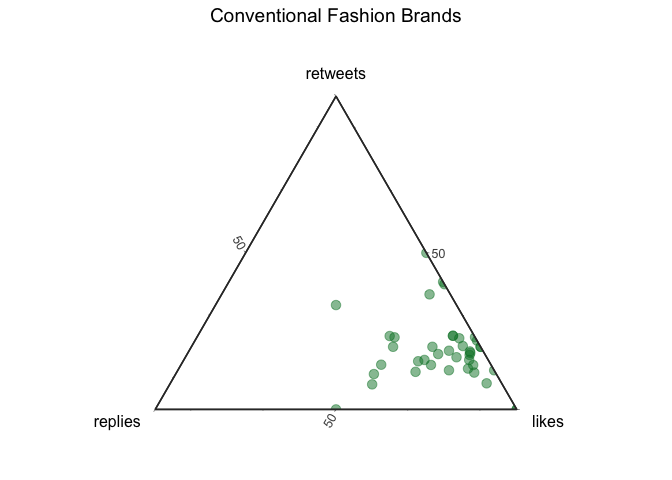

<!--
# To render the output to another directory, use the following lines in the YAML header
# Thanks https://stackoverflow.com/a/71826276
knit: (function(input, ...) {
    rmarkdown::render(
      input,
      output_dir = "../"
    )
  })
-->

# Background

-   Recent shifts toward the *metaverse pose a challenge to the dominant
    logic of conventional branding* and connecting consumers to brands
    through digital assets ([Hofstetter et
    al. 2022](https://link.springer.com/article/10.1007/s11002-022-09639-2);
    [Colicev 2022](https://doi.org/10.1016/j.ijresmar.2022.07.003)).
-   The seminal focus in this emerging area of marketing is the
    assumption that blending online and offline experiences in the
    metaverse enhances engagement and builds more communal experiences
    between brands and consumers.
-   One trend is the inception of *major brand events performed in the
    metaverse. The Metaverse Fashion Week* (MVFW), designed to provide
    immersive, digital fashion experiences, is a recent example.
-   The current work explores how fashion brands and other stakeholders
    in the metaverse (consumers, influencers, digital platform providers
    and crypto marketeers) *shape and funnel attention* during these
    events.

# Research Question

> Which of these stakeholders contribute and capitalize during major
> branding events in the metaverse and through which specific engagement
> tactics.

# Conceptual Model & Scoping of Key Stakeholders

-   Conventional fashion brands (green) open the gates between the
    physical and virtual sphere, i.e. web3.
-   Simultaneously, brands also expose their audiences to the native
    web3 stakeholders (red).
-   Hence, passive stakeholders risk to lose attention to other
    stakeholders and spheres.
-   We utilize scraped twitter data to identify key stakeholders and
    show how they manage to capitalize attention during a major digital
    fashion event (MVFW).

# Methods

We scraped tweets covering the MVFW & classify users into the respective
groups of stakeholders outlined previously. We then compare their
activity as well as the corresponding engagement metrics.

**Why MVFW?**

-   First large-scale metaverse event designed to attract a broad range
    of user groups.
-   This attracts stakeholders as well as audiences from both physical
    and virtual spheres.
-   Existence of free-riding possibilities.

**Why twitter?**

-   Represents voices of stakeholders and actions of attending and
    non-attending audiences.

## Query

    twint -s "mvfw OR (Metaverse Fashion Week)" --since "2022-03-23" --until "2022-03-28" --lang "en" -o dev/mvfw/data/timeFrames/tmp5.csv --csv

-   Tweets[^1] mentioning either `mvfw` or `metaverse`, `fashion` &
    `week`.
-   4 weeks prior, during and 4 weeks after the event.
-   Incremental procedure to reduce sampling issues[^2].
-   Additional search for brands.[^3] [^4]

*You can find all of the queries
[here](https://github.com/Howquez/mvfw/blob/main/data/queries.xlsx).*

## Data

-   1,644 unique users and 2,735 unique English tweets.
-   Passive and active engagement metrics (`likes`, `replies` &
    `retweets`).

# Results

| Segment                     | Active Users | Tweets | Likes  |
|:----------------------------|-------------:|-------:|:-------|
| Crypto Marketeers           |          353 |    718 | 15,104 |
| Digital Fashion             |           12 |     93 | 2,256  |
| Platform Providers          |            7 |     94 | 7,894  |
| Fashion Influencers         |           32 |     76 | 1,998  |
| Conventional Fashion Brands |           13 |     40 | 2,924  |

> Tweets toward the top have a higher share of retweets, those toward
> the bottom right have a higher share of likes, and those toward the
> bottom left are in the Ratio danger zone — a higher share of replies.
> [See
> FiveThirtyEight](https://fivethirtyeight.com/features/the-worst-tweeter-in-politics-isnt-trump/).

<!-- -->

-   Conventional fashion brands were relatively passive towards
    non-attending audiences (only 13 out of 30 tweeted at all).
-   Other web3-native stakeholders demonstrated greater overall activity
    and actively tagged conventional fashion brands to gain attention.
-   Although conventional fashion brands maximized user engagements
    through likes and comments, web3 stakeholders accounted for majority
    of activity and engagement (likes: 84%, retweets: 85%, replies:
    83%).
-   We conclude that the conventional fashion brands’ passiveness
    allowed especially crypto marketeers to ride the wave the brands
    created.

Brands’ tweets triggered mostly likes — which are easy to do and not as
public or expressive as a retweet, and which require less thought than a
reply.

<!-- -->

Influencers managed to score slightly higher on retweets and replies. In
addition, the tweets are more heterogeneous.

<!-- -->

Crypto Marketeers scored highest on retweets and replies. As a
consequence, their tweets effectively maximized reach compared to all
other stakeholders during MVFW event.

<!-- -->

Platform Providers achieve a similar engagement profile as brands with a
slightly higher density in likes.

<!-- -->

# Implications

## Theoretical

-   First systematic analysis on how seemingly unrelated stakeholders
    (such as Crypto Marketeers and web3 Platform Providers) enter
    branding events (such as the MVFW) to drive attention and traffic
    towards their own channels.
-   Important implications for how brands need to think beyond their own
    channels and audiences but also how decentralized branding events
    attract stakeholders that are unrelated, yet potentially harmful to
    their core business.

## Practical

-   Domain-specific events are at risk of free- riding entities that
    instrumentalize shifts towards the metaverse to effectively
    advertize (and ultimately sell) unrelated products (i.e. unrelated
    NFTs) during these events.
-   Low engagement of (and ultimately with) traditional fashion brands
    highlight the need to better integrate activities in both the web3
    and traditional social media channels (i.e. web2) to also draw non-
    attending audiences’ attention.

# Appendix

## Classification

I tag users such that they fall into different categories of
stakeholders. More precisely, I differentiate between two different
domains: `web3` and `physical`. In addition, I also create a second
dimension – the `product` describing either `platform`, `content` as
well as `fashion`.

To better visualize the classification, take a look at the following
table where the rows represent the domains and the columns represent the
product these stakeholders create (fashion, content, the platform
itself).

|              | Fashion                    | Content          | Platform          |
|--------------|----------------------------|------------------|-------------------|
| **Physical** | Conventional Fashion Brand | Influencer       | \-                |
| **Web3**     | Digital Fashion Brand      | Crypto Marketeer | Platform Provider |

I run a semi-automated classification approach by focusing on the
`username`s. More pecisely, I first use simple \_Regular expressions
using patterns such as `"nfts?|crypt|krypt|meta|block|coin"` to define
Crypto Marketeers and Influencers (`"fashion|beauty|luxury"`).
Morevover, I rely on the brands queried [above](#query) to define
Conventional Fashion Brands
(`data[username %in% brands[, unique(username)]`).

This yields many usernames that fall into neither of these categories,
which is where the manual part starts.

[^1]: We use [TWINT](https://github.com/twintproject/twint) and the
    command line interface.

[^2]: Because twitter limits scrolls while browsing a timeline, one can
    scrape about [3200 tweets per
    query](https://github.com/twintproject/twint#limits-imposed-by-twitter).
    For this reason, we run multiple queries and vary the time frames.

[^3]: In addition, we scrape data by usernames that represent brands we
    identified synthesizing different news articles that covered the
    event
    (e.g. [1](https://www.voguebusiness.com/technology/metaverse-fashion-week-the-hits-and-misses),
    [2](https://www.vogue.com/article/metaverse-fashion-week-decentraland),
    [3](https://decentraland.org/blog/announcements/metaverse-fashion-week-is-here/#flagship-stores),
    [4](https://www.lifestyleasia.com/ind/gear/tech/highlights-from-2022-metaverse-fashion-week/)
    and [5](https://metaversefashionweek.com/)). This yields a list of
    27 usernames that you can see with `brands[, unique(usernames)]`.

[^4]: More precisely, we used the following query:
    `twint -u [username] -s "mvfw OR (Metaverse Fashion Week)" --since "2022-02-23" --until "2022-04-24" --lang "en" -o dev/mvfw/data/brands/[username].csv --csv`.
