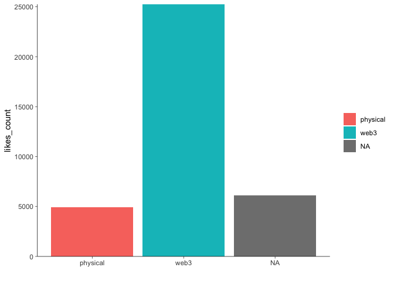
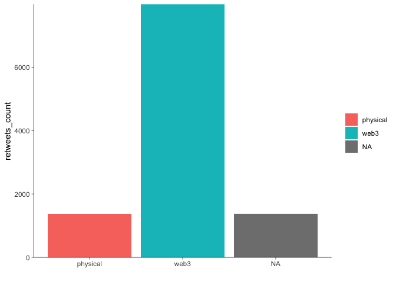

Freeriding the Metaverse
================

<!--
# To render the output to another directory, use the following lines in the YAML header
# Thanks https://stackoverflow.com/a/71826276
knit: (function(input, ...) {
    rmarkdown::render(
      input,
      output_dir = "../"
    )
  })
-->

Fast fashion is associated with waste, micro-plastics and a waste of
resources. [Digital fashion](https://www.netflix.com/watch/81197117)
promises to be superior to conventional (fast) fashion in all of these
regards as it allows consumers, for instance, to try on outfits
virtually such that they can better assess the clothing even before its
physical twins have been shipped. Another scenario is that it reduces
the consumption of physical fashion since the virtual products suffice
as a means to represent oneself in social media or the *metaverse*.

Along these lines several different stakeholders (including major brands
such as
[Forever21](https://twitter.com/Forever21/status/1507729045823234056)
and [Tommy
Hilfiger](https://twitter.com/TommyHilfiger/status/1507025541945245708))
started to experiment at the intersection of non fungible tokens (NFTs)
and fashion organizing the first ever *Metaverse Fashion Week* (MVFW)
online in March 2022. In addition, the 2022’s New York Fashion Week is
also accompanied by the [release of NFTs that match physical
products](https://www.forbes.com/sites/yolarobert1/2022/09/10/alo-yoga-debuts-its-first-ready-to-wear-collection-with-a-limited-edition-nft-at-new-york-fashion-week/).

Due to this recency, we scrape twitter data to better understand the key
stakeholders of the MVFW.

# Contents

The second section shows **[how we processed the data](#data)** while
the third section contains a brief **[exploratory
analysis](#exploration)**.

------------------------------------------------------------------------

*(The following four code chunks set up the document.)*

``` r
options(stringsAsFactors = FALSE)
invisible(Sys.setlocale(category = "LC_ALL", locale = "C"))
set.seed(42)
```

``` r
# install.packages("pacman")
pacman::p_load(magrittr, data.table, stringr, lubridate, # overviewR,
               ggplot2, MetBrewer, knitr, fs, purrr,
               qdapRegex)
```

``` r
# ggplot layout
layout <- theme(panel.background = element_rect(fill = "transparent", color = NA),
                plot.background = element_rect(fill = "transparent", color = NA),
                panel.grid = element_blank(),
                panel.grid.major.y = element_blank(),
                legend.key = element_rect(fill = "transparent"),
                axis.line = element_line(size = 0.25),
                axis.ticks = element_line(size = 0.25),
                plot.caption = element_text(colour = "#555555"),
                legend.title = element_blank()
)

# color
# colors <- met.brewer(name="Tam",n=7,type="discrete")
cPrimary = "#00802F"
cSecondary = "#EB6969"
cInfo = "#FFF04B"
cDanger <- "#EB6969"
```

``` r
STARTDATE <- as.Date("2022-03-23")
ENDDATE   <- as.Date("2022-03-27")
```

# Data

We query data using [TWINT](https://github.com/twintproject/twint) and
the command line interface. Because twitter limits scrolls while
browsing a timeline, one can scrape about [3200 tweets per
query](https://github.com/twintproject/twint#limits-imposed-by-twitter).
For this reason, we run multiple queries and vary them in two
dimensions: the [time frames](#time-frames) as well as the [user
names](#brands).

## Time frames

The following queries scrape data from all users that either mentioned
`mvfw` or `metaverse fashion week` in different periods between
2022-02-23 and 2022-04-27. The results are stored in different `.csv`
files, loaded and row-binded to one data.table called `tmp`.

    twint -s "mvfw OR (Metaverse Fashion Week)" --since "2022-02-23" --until "2022-03-02" --lang "en" -o dev/mvfw/data/timeFrames/tmp1.csv --csv
    twint -s "mvfw OR (Metaverse Fashion Week)" --since "2022-03-02" --until "2022-03-09" --lang "en" -o dev/mvfw/data/timeFrames/tmp2.csv --csv
    twint -s "mvfw OR (Metaverse Fashion Week)" --since "2022-03-09" --until "2022-03-16" --lang "en" -o dev/mvfw/data/timeFrames/tmp3.csv --csv
    twint -s "mvfw OR (Metaverse Fashion Week)" --since "2022-03-16" --until "2022-03-23" --lang "en" -o dev/mvfw/data/timeFrames/tmp4.csv --csv
    twint -s "mvfw OR (Metaverse Fashion Week)" --since "2022-03-23" --until "2022-03-28" --lang "en" -o dev/mvfw/data/timeFrames/tmp5.csv --csv
    twint -s "mvfw OR (Metaverse Fashion Week)" --since "2022-03-28" --until "2022-04-04" --lang "en" -o dev/mvfw/data/timeFrames/tmp6.csv --csv
    twint -s "mvfw OR (Metaverse Fashion Week)" --since "2022-04-04" --until "2022-04-11" --lang "en" -o dev/mvfw/data/timeFrames/tmp7.csv --csv
    twint -s "mvfw OR (Metaverse Fashion Week)" --since "2022-04-11" --until "2022-04-18" --lang "en" -o dev/mvfw/data/timeFrames/tmp8.csv --csv
    twint -s "mvfw OR (Metaverse Fashion Week)" --since "2022-04-18" --until "2022-04-27" --lang "en" -o dev/mvfw/data/timeFrames/tmp9.csv --csv

``` r
data_path    <- "../data/timeFrames/"
file_paths   <- fs::dir_ls(path = data_path, glob = "*.csv")
object_names <- str_replace_all(string = file_paths,
                                pattern = paste0(data_path, "|\\.csv"),
                                replacement = "")
datasets     <- purrr::map(file_paths, read.csv, sep = "\t")
tmp <- data.table::rbindlist(l = datasets)
```

## Brands

In addition, we scrape data by usernames that represent brands we
identified synthesizing different news articles that covered the
event.[^1]

This yields a list of 27 usernames.[^2] Replace `[username]` by the
desired brand to scrape the corresponding tweets between 2022-02-23 and
2022-04-24. The resulting `.csv` files are then again loaded and
row-binded to one data.table called `brands`.

    twint -u [username] -s "mvfw OR (Metaverse Fashion Week)" --since "2022-02-23" --until "2022-04-24" --lang "en" -o dev/mvfw/data/brands/[username].csv --csv

<!--
=CONCAT("twint -u ", B2, " -s "'mvfw OR (Metaverse Fashion Week)" --since "'2022-02-23" --until "'2022-04-24" --lang "'en" -o dev/mvfw/data/brands/", B2, ".csv --csv")
-->

``` r
data_path   <- "../data/brands/"
file_paths  <- fs::dir_ls(path = data_path, glob = "*.csv")
datasets    <- purrr::map(file_paths, read.csv, sep = "\t")
brands <- data.table::rbindlist(l = datasets)
```

## Refactor

First, row-bind both data.tables, i.e. `brands` and `tmp`.

``` r
temp <- data.table::rbindlist(l = list(tmp, brands))
```

Then make sure to use a common character encoding, remove ULRs before
you remove duplicate tweets. Subsequently, add an ID, work on time and
date formats, etc.

``` r
# String clean up 
temp[, tweet := iconv(tweet, "latin1", "ASCII", sub = "")]
temp[, tweet := rm_url(tweet,                    # remove URLs
                      pattern = pastex("@rm_twitter_url", "@rm_url"))]

# subset english sample of UNIQUE tweets
en <- temp[language == "en"] %>% unique(by = "tweet")

# create distinc ID
en[, doc_id := .I]

# change date & time format
en[, created_at := str_sub(string = created_at,
                           start  = 1,
                           end    = 19) %>% ymd_hms()]
en[, date := ymd(date)]

# store mentions (@....)
en[, customMentions := str_extract_all(string = tweet,
                                       pattern = "@\\S+")]
en[customMentions == "character(0)", 
   customMentions := NA]
en[, nMentions := str_count(string = customMentions, pattern = "@")]
```

``` r
en[, timing := "after"]
en[date <= ENDDATE, timing := "during"]
en[date < STARTDATE, timing := "before"]

en[, timing := factor(timing,
                      ordered = TRUE,
                      levels  = c("before", "during", "after"))]
```

``` r
# re-arrange data for corpus
data <- en[date <= as.Date("2022-04-24"), # due to brands query
           .(doc_id,
             text = tweet,
             hashtags,
             cashtags,
             username,
             mentions,
             customMentions,
             nMentions,
             name,
             place,
             urls,
             photos,
             video,
             geo,
             timing,
             date,
             created_at,
             timezone,
             replies_count,
             retweets_count,
             likes_count,
             language,
             id,
             conversation_id,
             retweet_id)]
```

## Classification

Now, we’ll tag users such that they fall into different categories of
stakeholders. More precisely, I differentiate between two different
domains: `web3` and `fashion`. In addition, I also create a second
dimension – the `type` describing either `platform providers`,
`content creators`, who one could also describe as evangelists or
influencers, as well as `fashion creators`.

Note that:[^3]

-   conventional brands are described by
    `domain =="fashion" & type=="fashion creators"`.
-   fashion influencers are described by
    `domain =="fashion" & type=="content creators"`.
-   web3 evangelists are described by
    `domain =="web3" & type=="content creators"`.
-   digital fashion brands are described by
    `domain =="web3" & type=="fashion creators"`.

I’ve done the classification in a semi-automated way by focusing on the
`username`s.

### Automated heuristics

First, I apply regular expressions to tag web3 content creators.

``` r
data[str_detect(string = username,
                pattern = "nfts?|crypt|krypt|meta|block|coin"),
     `:=`(domain = "web3",
          type   = "content creators")]
```

Next, I use a similar approach to tag fashion and beauty related content
creators.

``` r
data[str_detect(string = username,
                pattern = "fashion|beauty|luxury"),
     `:=`(domain = "fashion",
          type   = "content creators")]
```

This yields many usernames that fall into neither of these categories.
This is where the manual part starts.

### Manual inspection

The following figure shows a density plot that illustrates the number of
likes a user received.[^4]

``` r
tmp <- data[is.na(domain), 
     .(likes = sum(likes_count, na.rm = TRUE)),
     by = username][order(-likes)]

ggplot(data = tmp[likes > 0 & likes < 1000],
       mapping = aes(x = likes)) +
  # geom_histogram(fill = cPrimary, binwidth = 5) +
  geom_density(fill = cPrimary, alpha = 0.66, col = cPrimary) +
  scale_y_continuous(limits = c(0, NA),
                     expand = c(0, NA)) +
  layout
```

<!-- -->

``` r
known   <- tmp[1:100, sum(likes)]
overall <- tmp[, sum(likes)]
share   <- round(100*known/overall)
```

Next, I display a table of the 100 most relevant users, measured by the
number of likes they received for all their posts in our data. These 100
users account for 80% of the likes we observe in our data that are not
yet categorized by the automatic approach outlined
[above](#automated-heuristics).

``` r
tmp %>% 
  head(100) %>%
  kable()
```

| username        | likes |
|:----------------|------:|
| bosonprotocol   |  4049 |
| decentraland    |  2382 |
| thalia          |   929 |
| dolcegabbana    |   855 |
| deadfellaz      |   822 |
| tommyhilfiger   |   666 |
| exclusible      |   662 |
| xrcouture       |   599 |
| thefabricant    |   468 |
| maghanmcd       |   408 |
| hoganbrand      |   395 |
| gossapegirl     |   383 |
| asian_mint      |   340 |
| canessadcl      |   308 |
| ericpi888       |   306 |
| etroofficial    |   298 |
| itskac          |   294 |
| threedium       |   260 |
| marc0matic      |   258 |
| antisecretsoci2 |   247 |
| auroboros_ltd   |   230 |
| esteelauder     |   228 |
| pangeadao       |   225 |
| cmnnewsofficial |   221 |
| diamondhandbag  |   209 |
| dragoncityio    |   202 |
| polygondressing |   191 |
| wirelyss        |   184 |
| cathyhackl      |   181 |
| \_mannyalves    |   170 |
| maryanadcl      |   160 |
| martinshibuya   |   156 |
| eagle_stephen\_ |   150 |
| 8sianmom        |   145 |
| realfaithtribe  |   143 |
| tokens_com      |   142 |
| the_vogu        |   141 |
| mrbathinape     |   140 |
| michi_todd      |   123 |
| bitpanda        |   117 |
| whiterabbitgate |   114 |
| brytehall       |   112 |
| universelle_io  |   109 |
| kcain1982       |   109 |
| borgetsebastien |   109 |
| nikkifuego92    |   106 |
| barbarakahn     |   101 |
| diviproject     |    98 |
| puma            |    92 |
| ziziverse       |    89 |
| shopcider       |    87 |
| astronotseth    |    85 |
| houseofdaw      |    84 |
| neuno_io        |    83 |
| yannakis_dcl    |    80 |
| xpozd_io        |    79 |
| tangpoko        |    79 |
| nicole29nixon   |    78 |
| thesevens_7     |    78 |
| 0xjoules        |    76 |
| teenybod        |    75 |
| stylexchange_io |    75 |
| celinatech      |    75 |
| enilev          |    74 |
| siddharthakur   |    74 |
| dressxcom       |    72 |
| pedroguez\_\_   |    71 |
| andywangnyla    |    70 |
| altavagroup     |    69 |
| ww_ventures     |    67 |
| davidcash888    |    66 |
| qdibs_eth       |    63 |
| realsophiarobot |    63 |
| parzival_kazuto |    61 |
| manadaiquiridcl |    61 |
| madamape        |    61 |
| decentralgames  |    61 |
| degenitamar     |    59 |
| reuters         |    59 |
| projectmediahq  |    58 |
| dcljasonx       |    58 |
| forbeslife      |    57 |
| mutani_io       |    56 |
| 0xquiksilver    |    55 |
| reginaturbina   |    54 |
| jonassft        |    53 |
| bitski          |    53 |
| jtv\_\_\_\_     |    52 |
| forbes          |    52 |
| lingxing_dcl    |    51 |
| soultrydubs     |    51 |
| dogmandcl       |    50 |
| knownorigin_io  |    50 |
| danitpeleg3d    |    50 |
| voguebusiness   |    49 |
| survive_p2e     |    49 |
| mgh_dao         |    49 |
| serenaelis\_    |    47 |
| koryptostylist  |    47 |
| voguesingapore  |    47 |

Subsequently, I search the top 100 users in twitter using a web browser,
read their description (or biography) as well their posts in our data.
Having reviewed all of them, I’ll classify them by hand.

``` r
# tag web3 freeriders
data[username %in% c("Deadfellaz", "gossapegirl", "asian_mint", "canessadcl",     # NAME WEB3 HERE!
                     "ericpi888", "itskac", "antisecretsoci2", "cmnnewsofficial",
                     "cathyhackl", # maybe too much fame to be a free rider?
                     "btctn", "_mannyalves", "maryanadcl", "martinshibuya",
                     "eagle_stephen_", "8sianmom", "tokens_com", "mrbathinape",
                     "michi_todd", "bitpanda", "brytehall", "universelle_io",
                     "kcain1982", "borgetsebastien", "barbarakahn", "diviproject",
                     "ziziverse", "astronotseth", "yannakis_dcl", "xpozd_io",
                     "tangpoko", "thesevens_7", "portionapp", "0xjoules",
                     "teenybod", "celinatech", "enilev", "siddharthakur",
                     "pedroguez__", "additionalrules", "media_diamante",
                     "altavagroup", "ww_ventures", "davidcash888", "move78studio",
                     "qdibs_eth", "realsophiarobot", "manadaiquiridcl",
                     "madamape", "decentralgames", "projectmediahq", "dcljasonx",
                     "mutani_io", "0xquiksilver", "reginaturbina", "jtv____",
                     "dogmandcl", "soultrydubs", "lingxing_dcl", "knownorigin_io",
                     "danitpeleg3d", "survive_p2e", "mgh_dao", "serenaelis_",
                     "koryptostylist",
                     "deadfellaz" # not sure where to put these guys since they have some sort of cooperation
                     ), 
     `:=`(domain = "web3",
          type   = "content creators")]

# tag web3 x fashion
data[username %in% c("thefabricant", "xrcouture", "auroboros_ltd", "wirelyss",    # NAME WEB3 FASHION HERE!
                     "polygondressing", "the_vogu", "shopcider", "houseofdaw",
                     "neuno_io", "stylexchange_io", "parzival_kazuto", "bitski"), 
     `:=`(domain = "web3",
          type   = "fashion creators")]

# tag content creators & media
data[username %in% c("thalia", "maghanmcd", "diamondhandbag", "realfaithtribe"   # NAME CONTENT CREATORS HERE!
                     ), 
     `:=`(domain = "fashion",
          type   = "content creators")]

# tag fashion brands
data[username %in% brands[, unique(username)], # NAME BRANDS HERE!
     `:=`(domain = "fashion",
          type   = "fashion creators")]

# tag platform- or ecosystem related users
data[username %in% c("decentraland", "bosonprotocol", "exclusible", "threedium",  # NAME PLATFORMS HERE!
                     "pangeadao", "dragoncityio", "whiterabbitgate"), 
     `:=`(domain = "web3",
          type   = "platform providers")]
```

The data contains 1.320 rows, each representing a tweet. Its columns
represent some IDs, meta information about URLs, retweets, etc. as well
as the tweets itself (from which I removed URLs using
`qdapRegex::rm_url()`).

``` r
data <- data[,
             .(doc_id,
               text,
               username,
               domain,
               type,
               timing,
               date,
               created_at,
               replies_count,
               retweets_count,
               likes_count,
               mentions,
               customMentions,
               nMentions,
               name,
               place,
               urls,
               photos,
               video,
               geo,
               timezone,
               language,
               id,
               conversation_id,
               retweet_id,
               hashtags,
               cashtags)]

save(data, file = "../data/processed/mvfw.RData")
```

# Exploration

Here is a list of the 25 users who received the most likes. Almost all
of them are centered around the web3 domain.

``` r
data[, .(likes = sum(likes_count, na.rm = TRUE)), by = c("username", "domain", "type")][order(-likes)] %>% head(25) %>% kable()
```

| username      | domain  | type               | likes |
|:--------------|:--------|:-------------------|------:|
| bosonprotocol | web3    | platform providers |  4049 |
| decentraland  | web3    | platform providers |  2382 |
| fanggangnft   | web3    | content creators   |  1317 |
| 8siannft      | web3    | content creators   |   956 |
| thalia        | fashion | content creators   |   929 |
| dolcegabbana  | fashion | fashion creators   |   855 |
| metaweartoken | web3    | content creators   |   854 |
| deadfellaz    | web3    | content creators   |   822 |
| tommyhilfiger | fashion | fashion creators   |   666 |
| exclusible    | web3    | platform providers |   662 |
| parcelnft     | web3    | content creators   |   655 |
| xrcouture     | web3    | fashion creators   |   599 |
| thefabricant  | web3    | fashion creators   |   468 |
| maghanmcd     | fashion | content creators   |   408 |
| hoganbrand    | fashion | fashion creators   |   395 |
| gossapegirl   | web3    | content creators   |   383 |
| themetakey    | web3    | content creators   |   379 |
| asian_mint    | web3    | content creators   |   340 |
| therebelsnft  | web3    | content creators   |   324 |
| canessadcl    | web3    | content creators   |   308 |
| ericpi888     | web3    | content creators   |   306 |
| etroofficial  | fashion | fashion creators   |   298 |
| itskac        | web3    | content creators   |   294 |
| threedium     | web3    | platform providers |   260 |
| marc0matic    | fashion | fashion creators   |   258 |

## Tweets by domain

### Number of Tweets

``` r
data[, .N, by = domain] %>% kable()
```

| domain  |    N |
|:--------|-----:|
| NA      | 1707 |
| web3    |  901 |
| fashion |  103 |

``` r
tmp <- data[, .N, by = c("username", "domain")]
ggplot(data = tmp,
       mapping = aes(x = domain, y = N, fill = domain)) +
  geom_bar(stat = "identity") +
  scale_y_continuous(limits = c(0, NA),
                     expand = c(0, NA)) +
  layout +
  labs(x = "")
```

<!-- -->

### Number of Likes

``` r
ggplot(data = data[, .(domain, likes_count)],
       mapping = aes(x = domain, y = likes_count, fill = domain)) +
  geom_bar(stat = "identity") +
  scale_y_continuous(limits = c(0, NA),
                     expand = c(0, NA)) +
  layout +
  labs(x = "")
```

<!-- -->

### Number of Retweets

``` r
ggplot(data = data[, .(domain, retweets_count)],
       mapping = aes(x = domain, y = retweets_count, fill = domain)) +
  geom_bar(stat = "identity") +
  scale_y_continuous(limits = c(0, NA),
                     expand = c(0, NA)) +
  layout +
  labs(x = "")
```

<!-- -->

## Tweets by type

### Number of Tweets

``` r
data[, .N, by = type] %>% kable()
```

| type               |    N |
|:-------------------|-----:|
| NA                 | 1707 |
| content creators   |  777 |
| fashion creators   |  133 |
| platform providers |   94 |

``` r
tmp <- data[, .N, by = c("username", "type")]
ggplot(data = tmp,
       mapping = aes(x = type, y = N, fill = type)) +
  geom_bar(stat = "identity") +
  scale_y_continuous(limits = c(0, NA),
                     expand = c(0, NA)) +
  layout +
  labs(x = "")
```

<!-- -->

### Number of Likes

``` r
ggplot(data = data[, .(type, likes_count)],
       mapping = aes(x = type, y = likes_count, fill = type)) +
  geom_bar(stat = "identity") +
  scale_y_continuous(limits = c(0, NA),
                     expand = c(0, NA)) +
  layout +
  labs(x = "")
```

<!-- -->

### Number of Retweets

``` r
ggplot(data = data[, .(type, retweets_count)],
       mapping = aes(x = type, y = retweets_count, fill = type)) +
  geom_bar(stat = "identity") +
  scale_y_continuous(limits = c(0, NA),
                     expand = c(0, NA)) +
  layout +
  labs(x = "")
```

<!-- -->

## Tweets by type x domain

``` r
data[, .(`Number of tweets` = .N), by = c("domain", "type")] %>% kable()
```

| domain  | type               | Number of tweets |
|:--------|:-------------------|-----------------:|
| NA      | NA                 |             1707 |
| web3    | content creators   |              714 |
| web3    | fashion creators   |               93 |
| web3    | platform providers |               94 |
| fashion | content creators   |               63 |
| fashion | fashion creators   |               40 |

``` r
data[, .(`Number of likes` = sum(likes_count)), by = c("domain", "type")] %>% kable()
```

| domain  | type               | Number of likes |
|:--------|:-------------------|----------------:|
| NA      | NA                 |            6249 |
| web3    | content creators   |           14961 |
| web3    | fashion creators   |            2256 |
| web3    | platform providers |            7894 |
| fashion | content creators   |            1835 |
| fashion | fashion creators   |            2924 |

``` r
data[, .(`Number of retweets` = sum(retweets_count)), by = c("domain", "type")] %>% kable()
```

| domain  | type               | Number of retweets |
|:--------|:-------------------|-------------------:|
| NA      | NA                 |               1389 |
| web3    | content creators   |               5057 |
| web3    | fashion creators   |                917 |
| web3    | platform providers |               1976 |
| fashion | content creators   |                517 |
| fashion | fashion creators   |                825 |

# Timing

## Timing x domain

How much was posted before, during and after the MVFW?

``` r
tmp <- data[!is.na(domain), .(N = .N), by = c("timing", "domain")][order(domain)]
tmp[, sum := sum(N), by = domain]
tmp[, share := paste0(round(100*N/sum), "%")]
tmp %>% kable()
```

| timing | domain  |   N | sum | share |
|:-------|:--------|----:|----:|:------|
| before | fashion |  42 | 103 | 41%   |
| during | fashion |  39 | 103 | 38%   |
| after  | fashion |  22 | 103 | 21%   |
| before | web3    | 506 | 901 | 56%   |
| during | web3    | 210 | 901 | 23%   |
| after  | web3    | 185 | 901 | 21%   |

Even though we queried the data such that the duration of the time
`before` is exactly as long as the duration of the time `after` (+/-28
days), we count less tweets in both domains (web3 as well as fashion)
posted after the MVFW took place.

``` r
data[, min(date)] - STARTDATE
data[, max(date)] - ENDDATE
```

The same holds true for the number of likes received…

``` r
tmp <- data[!is.na(domain), .(N = sum(likes_count)), by = c("timing", "domain")][order(domain)]
tmp[, sum := sum(N), by = domain]
tmp[, share := paste0(round(100*N/sum), "%")]
tmp %>% kable()
```

| timing | domain  |     N |   sum | share |
|:-------|:--------|------:|------:|:------|
| before | fashion |   943 |  4759 | 20%   |
| during | fashion |  3660 |  4759 | 77%   |
| after  | fashion |   156 |  4759 | 3%    |
| before | web3    | 16224 | 25111 | 65%   |
| during | web3    |  5952 | 25111 | 24%   |
| after  | web3    |  2935 | 25111 | 12%   |

…as well as for the number of retweets.

``` r
tmp <- data[!is.na(domain), .(N = sum(retweets_count)), by = c("timing", "domain")][order(domain)]
tmp[, sum := sum(N), by = domain]
tmp[, share := paste0(round(100*N/sum), "%")]
tmp %>% kable()
```

| timing | domain  |    N |  sum | share |
|:-------|:--------|-----:|-----:|:------|
| before | fashion |  317 | 1342 | 24%   |
| during | fashion |  932 | 1342 | 69%   |
| after  | fashion |   93 | 1342 | 7%    |
| before | web3    | 5240 | 7950 | 66%   |
| during | web3    | 1677 | 7950 | 21%   |
| after  | web3    | 1033 | 7950 | 13%   |

However, both of these engagement metrics (`likes_count` and
`retweets_count`) show different patterns across domains. The web3
domain triggered by far the most engagement before the event, while the
fashion domain received the most attention during the event (on the
basis of a comparable amount of tweets).

## Timing x type

How much was posted before, during and after the MVFW?

``` r
tmp <- data[!is.na(domain), .(N = .N), by = c("timing", "type")][order(type)]
tmp[, sum := sum(N), by = type]
tmp[, share := paste0(round(100*N/sum), "%")]
tmp %>% kable()
```

| timing | type               |   N | sum | share |
|:-------|:-------------------|----:|----:|:------|
| before | content creators   | 423 | 777 | 54%   |
| during | content creators   | 166 | 777 | 21%   |
| after  | content creators   | 188 | 777 | 24%   |
| before | fashion creators   |  60 | 133 | 45%   |
| during | fashion creators   |  62 | 133 | 47%   |
| after  | fashion creators   |  11 | 133 | 8%    |
| before | platform providers |  65 |  94 | 69%   |
| after  | platform providers |   8 |  94 | 9%    |
| during | platform providers |  21 |  94 | 22%   |

# Examplary Tweets

## Fashion

``` r
data[domain == "fashion", type == "fashion creator", text][sample(.N, 15)] %>% kable()
```

| text                                                                                                                                                                                                                                      | V1    |
|:------------------------------------------------------------------------------------------------------------------------------------------------------------------------------------------------------------------------------------------|:------|
| Coming soon! \#MVFW \#DolceGabbana \#decentralized \#decentralizedland \#nft \#Wearables                                                                                                                                                  | FALSE |
| The Marc-O-Matic Store is live in @decentraland for \#Metaverse Fashion Week Big shout out to Decentraland team, @rarible @themetakey For this opportunity. Store Located: -49,69 \#MVFW22 \#nfts \#fashion \#3d \#NFTCommumity \#MATIC   | FALSE |
| \#MVFW hosted artists and designers including fashion giants like Tommy Hilfiger, Este Lauder, Philipp Plein, Selfridges and Dolce & Gabbana.                                                                                             | FALSE |
| We are excited to join @decentraland in the very first \#Metaverse \#fashionweek More coming soon                                                                                                                                         | FALSE |
| The Liquid Paisley collection takes to the catwalk at the first-ever Etro Metaverse fashion show in @Decentraland. \#UNXD \#MVFW                                                                                                          | FALSE |
| “DO WE REALLY NEED \#Metaverse FASHION WEEK?” YES!!!                                                                                                                                                                                      | FALSE |
| Inspired by the next frontier of digital technology \#TommyHilfiger will be adopting @BosonProtocol during \#MVFW in @Decentraland to enable the sale of physical items as \#NFTs in \#BosonPortal. Join us!                              | FALSE |
| During the opening events, @Threedium and @decentraland will host @CathyHackl as the first-ever Official Chair of \#Metaverse \#FashionWeek                                                                                               | FALSE |
| Moore From L.A.: What Is Metaverse Fashion Week? The Decentraland Event’s Creator, Producer Explain - WWD                                                                                                                                 | FALSE |
| Join us at the world’s first-ever Metaverse Fashion Week, happening on @decentraland now. Featuring an eye-catching floral print, our digital pop-up booth is impossible to miss. Discover more: \#MetaCharlesKeith \#MVFW \#Decentraland | FALSE |
| \#DolceGabbana showcases at the First Metaverse Virtual Fashion Week hosted by @decentraland in partnership with @unxd_nft. Enter the metaverse and explore the Dolce&Gabbana pop-up at                                                   | FALSE |
| Thrilled to be part of the first Metaverse Fashion Week on \#Decentraland. \#Savethedate March, 25th at 4pm CET. \#MVFW                                                                                                                   | FALSE |
| The runway is going virtual again! @Decentraland collabs with @UNXD_NFT to present ‘Metaverse Fashion Week.’ The week will consist of designer showcases, pop-up shops, after parties on March 24th 27th 2022.                            | FALSE |
| OMWow! We have our address and we’re right next to @Acura in Decentraland!!! Stay tuned for our scheduling during Metaverse Fashion Week! @decentraland                                                                                   | FALSE |
| How the metaverse influenced New York Fashion Week via @voguebusiness                                                                                                                                                                     | FALSE |

``` r
data[domain == "fashion", type == "content creator", text][sample(.N, 15)] %>% kable()
```

| text                                                                                                                                                                                                                                                              | V1    |
|:------------------------------------------------------------------------------------------------------------------------------------------------------------------------------------------------------------------------------------------------------------------|:------|
| ————————————– : \#fashion \#celebrities \#news \#tipsoffashion \#metaverse \#fashionweek \#upcoming                                                                                                                                                               | FALSE |
| \#DolceGabbana showcases at the First Metaverse Virtual Fashion Week hosted by @decentraland in partnership with @unxd_nft. Enter the metaverse and explore the Dolce&Gabbana pop-up at                                                                           | FALSE |
| Virtual social world @decentraland is continuing its preparations for the launch of Metaverse Fashion Week, set to take place from March 24 to 27. \#metaverse \#metaversefashionweek \#fashionweek \#decentraland \#NFT                                          | FALSE |
| @ggcasimiro\_ What you can expect from @decentraland is not only the luxury street, we have the Rareable street with indie designerstake a look at the schedule#mvfw @XRCouture @subham101                                                                        | FALSE |
| Weve transformed \#AdvancedNightRepair into a \#Metaverse experience and created a wearable NFT inspired by our number one serum designed by \#EsteePartner @thealexbox. Experience it for yourself & get the wearable before its gone @decentralands \#MVFW now: | FALSE |
| Dolce & Gabbana embrace the \#Metaverse at Milan fashion week                                                                                                                                                                                                     | FALSE |
| It’s time to unveil more \#HoganX Untraditional afterparty with @exclusible will hit @decentraland on March 26th Keep an eye out, more to follow! \#HOGAN \#MVFW                                                                                                  | FALSE |
| @ggcasimiro\_ We can clearly see the big luxury houses embracing the \#mvfw. It will impact the way we see fashion and the way we consume fashion. @XRCouture @decentraland @subham101 @aninanet                                                                  | FALSE |
| DRESSX x MTA METAVERSE FASHION WEEK Tmrw @ 10am EST / 3pm CET at the @theMTAofficial Catwalk (96,-13) in DCL! Collect all 4 of our POAPS for an NFT AIRDROP! Join our discord to find out more!                                                                   | FALSE |
| How the metaverse influenced New York Fashion Week via @voguebusiness                                                                                                                                                                                             | FALSE |
| Paris Fashion Week supports the metaverse \#fashionweek \#digital \#fashiontech \#metaverse \#blockchain                                                                                                                                                          | FALSE |
| Alpha DiamondHandBag x @gossapegirl are featured on the runways of Metaverse Fashion Week on March 24 We’re the FIRST EVER Handbag Wearable available on @Decentraland WIN 1 of 5 DiamondHandBag wearables: ENTER RT, Like & Tag 3 Friends \#MVFW \#Gossapegirls  | FALSE |
| Moore From L.A.: What Is Metaverse Fashion Week? The Decentraland Event’s Creator, Producer Explain - WWD                                                                                                                                                         | FALSE |
| @LUCII_UV Where can we find the @decentraland metaverse fashion week schedule?                                                                                                                                                                                    | FALSE |
| Here’s this week’s @voguebusiness NFT Tracker, with projects from @flexworld\_, @CryptopantiesRR, @XRCouture and @aliceandolivia. The XR Couture items dropped today – might be a wardrobe option for Metaverse Fashion Week?                                     | FALSE |

## Web3

``` r
data[domain == "web3", type == "fashion creator", text][sample(.N, 15)] %>% kable()
```

| text                                                                                                                                                                                                                                                                             | V1    |
|:---------------------------------------------------------------------------------------------------------------------------------------------------------------------------------------------------------------------------------------------------------------------------------|:------|
| Only 3 more days to Boson Portal Fashion District launch Metaverse Fashion Week 24th - 27th March                                                                                                                                                                                | FALSE |
| @decentraland will host the Metaverse Fashion Week, which will start on March 24th The event will feature designers such as Tommy Hilfiger and Paco Rabanne \#event \#fashion \#designers \#metaverse \#web3 \#fashion \#fashionindustry \#fashionweek                           | FALSE |
| Why thank you for the follow on IG @decentraland Looking forward to not only DJing more events in DCL but to continue to grow within the community with my parcel and wearables! Thanks for such an awesome year so far \#decentraland \#metaverse \#MVFW                        | FALSE |
| Fashion week is getting closer… stay tuned for more! \#MVFW \#FashionNFT \#digitalfashion \#WearableNFT \#Metaverse \#virtualrunway \#NFTCommunity                                                                                                                               | FALSE |
| Thank you guys for sharing your dope looks wearing \#AllThatGlitter I cant decide which one is my favorite, but as promised I just dropped those who shared their pic another look! Enjoy \#mvfw \#web3fashion \#Metaverse                                                       | FALSE |
| Heres my submission for \#MVFW The T-Rax helmets ! @decentraland @MetaPartyDCL @ParcelNFT \#Metaverse \#MANA                                                                                                                                                                     | FALSE |
| \#MVFW where expressing fashion has no limits @DragonCityIO @MetaverseLabs \#DragonStyle @JsCoincollector @nmkenji @KanardAzul                                                                                                                                                   | FALSE |
| RARE FASHION NFT GIVEAWAY To celebrate our participation in @decentraland’s \#metaverse fashion week, we’re giving away this RARE 1/1 NFT by @radarboy3000 To enter: 1Like & Retweet this tweet 2Follow us on Twitter 3Join our Discord and say                                  | FALSE |
| We are excited to announce our partnership with @OpenTeeIO for Metaverse Fashion Week and future Metaverse events! OpenTee is creating unique Pangea wearables for our Fashion Week event that will be featured on our catwalk. Make sure to be there for the chance to get one! | FALSE |
| Metaverse Fashion Week was fun - cu next time @MetaWearDrip @avewarriors @decentraland @dolcegabbana @UNXD_NFT \#MVFW22 \#MVFW                                                                                                                                                   | FALSE |
| WLDFNGZ IS COMING. Metaverse Fashion Week Limited Capsule Drop March 24th                                                                                                                                                                                                        | FALSE |
| Guess where we’ll show up @decentraland @MetaverseLabs \#Decentraland \#Metamotive \#NFTdrop \#NFTs \#NFTCommmunity \#3D \#fashion \#MVFW                                                                                                                                        | FALSE |
| Tommy Hilfiger to Showcase Spring 2022 Collections and \#NFT Wearables at Decentralands \#Metaverse Fashion Week \#CryptoCurrencyNews via @coinjupiter                                                                                                                           | FALSE |
| International Fashion Week Dubai Makes History; being the first Fashion Week to convert into NFT’s \#fashion \#nfts \#dubai \#NFT \#Metaverse                                                                                                                                    | FALSE |
| Dress like youre already famous Make me famous! Meow\~ \#FashionWeek Join the Catto Fam: \#Metaverse \#NFTProject \#NFTCommmunity \#Polygon \#PolygonNFT \#NFTCommunity \#NFTGiveaway \#AnimeNFT \#NFT \#SneakPeak \#GameFi \#NFTcollections                                     | FALSE |

``` r
data[domain == "web3", type == "content creator", text][sample(.N, 15)] %>% kable()
```

| text                                                                                                                                                                                                                                                                            | V1    |
|:--------------------------------------------------------------------------------------------------------------------------------------------------------------------------------------------------------------------------------------------------------------------------------|:------|
| JAPANESE COMMUNITY MEET-UP \#2 \#MVFW We’ll see you in 2 hrs! Hosted by our CM @\_Ks_Library Meet-up: Discord: Pop-up Space:                                                                                                                                                    | FALSE |
| On March 22, American cosmetics brand Estee Lauder will serve as the exclusive beauty brand partner of Metaverse Fashion Week in Decentraland. Read More                                                                                                                        | FALSE |
| This is going to be special, thanks for choosing Xpozd. \#MVFW                                                                                                                                                                                                                  | FALSE |
| HOLE-Y-GOLD!!! Submitting this glowy, shiny, slicy see-thru number for MVFW 22 Competition \#MVFW Good Luck Creators @MetaPartyDCL @ParcelNFT @decentraland                                                                                                                     | FALSE |
| What a way to start the Week with @MoMamiMusic!! Thanks to the @DCLBabyDolls for the event \#MVFW \#InternationalWomensMonth                                                                                                                                                    | FALSE |
| Mark your calendars We are launching 2 exclusive \#NFT projects from notable \#fashion \#photographers (March 24th -27th) at Metaverse Fashion Week in (#Decentraland). Turn on Notifications \#Discord Opens Soon! \#mvfw \#fashionsweek \#NFTs \#NFTCommunity \#nftcollectors | FALSE |
| Cider in Decentraland. Count us in. 3/24/2022 - 3/27/2022 \#MVFW \#Ciderland \#Decentraland \#Metaverse                                                                                                                                                                         | FALSE |
| Yaaaay! Countdown to \#MVFW . I’m as excited as a a kid in a candy store \#nftspace - anyone else planning to join?                                                                                                                                                             | FALSE |
| CRYPTO NEWS ALERT! The first-ever Metaverse Fashion Week: Digital fashion is here to stay \# \#Crypto \#BTC \#ETH \#DOGE                                                                                                                                                        | FALSE |
| Want to know what went down at the first ever Metaverse Fashion Week. This article has all the deets. \#Metaverse \#fashion                                                                                                                                                     | FALSE |
| What a journey its been @decentraland @tiktok_us Follow me on tiktok for more Metaverse content! My Day 3 DJ set starts in 1 hour! Come to coordinates 2,17 Footage by @MetaPartyDCL @NewLegendsNFT \#MVFW \#Mana \#metaverse \#nft \#fashionweek                               | FALSE |
| Honored to have @RealSophiaRobot walking the runway for \#DOCTORdripp wearables :) at \#MVFW @decentraland \#findingsophiatherobot @percylau_studio @HansonRobotics @em_DCL @PeanutbuttaDCL                                                                                     | FALSE |
| & Decentraland Announce Brands Participating in Metaverse Fashion Week \| Corp. (NEO Exchange Canada: COIN) (Frankfurt Stock Exchange: 76M) (OTCQB US: SMURF) ( \#decentraland                                                                                                  | FALSE |
| We’re live at the @decentraland \#MVFW closing party with @AUROBOROS_LTD X @Grimezsz Grimes is seen exclusively dressed in the ‘Mystique’ bodysuit available in Auroboros World in Boson Portal, the metaverse marketplace to buy physical items as \#NFTs                      | FALSE |
| \#Decentraland (#MANA), a virtual gaming marketplace, is poised to organise the first-ever \#Metaverse Fashion Week (#MVFW) on its platform. - Bitcoinleef                                                                                                                      | FALSE |

[^1]: e.g. [1](https://www.voguebusiness.com/technology/metaverse-fashion-week-the-hits-and-misses),
    [2](https://www.vogue.com/article/metaverse-fashion-week-decentraland),
    [3](https://decentraland.org/blog/announcements/metaverse-fashion-week-is-here/#flagship-stores),
    [4](https://www.lifestyleasia.com/ind/gear/tech/highlights-from-2022-metaverse-fashion-week/)
    and [5](https://metaversefashionweek.com/)

[^2]: tommyhilfiger, forever21, esteelauder, KarlLagerfeld, McQueen,
    dkny, dressxcom, dolcegabbana, EtroOfficial, FranckMuller,
    Selfridges, Bulova, PacoRabanne, ArtistVasarely, PUMA, PerryEllis,
    Fred_Segal, VAULTswiss, MissJAlexander, marc0matic, Charles_Keith,
    priveporter, philipp_plein, ElieSaabWorld, HoganBrand, IOCNFTs,
    dundaslondon

[^3]: Note to myself: create table, if two dimensions are really
    required.

[^4]: I limit this figure to users that received at least one but less
    than 1000 likes.
