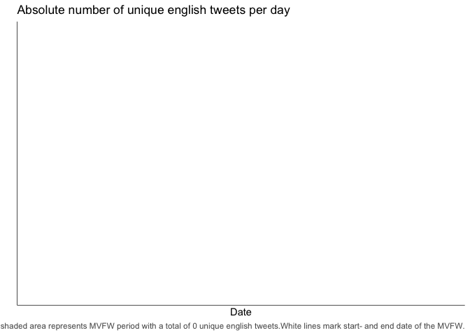
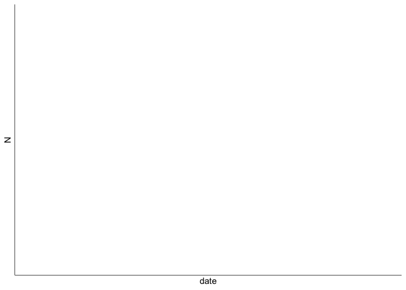
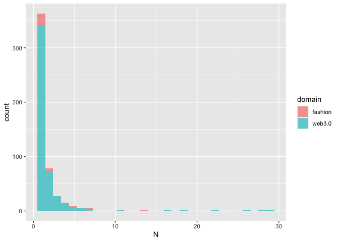
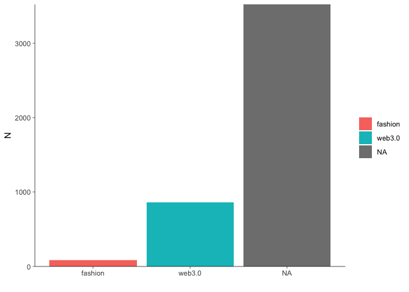
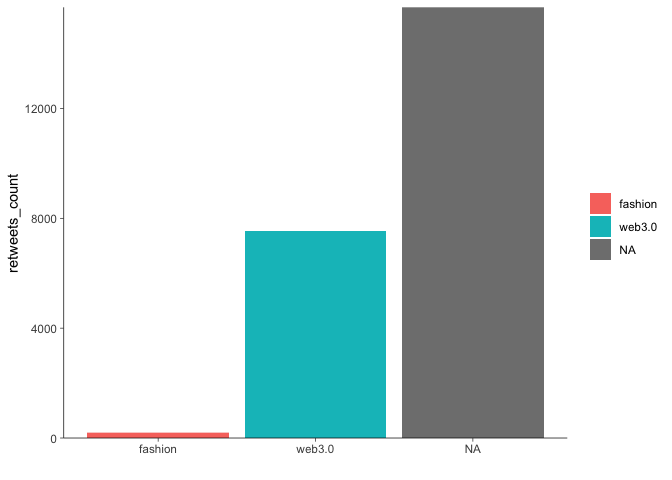

Hijacking the Metaverse
================

``` r
options(stringsAsFactors = FALSE)
invisible(Sys.setlocale(category = "LC_ALL", locale = "C"))
set.seed(42)
```

``` r
# install.packages("pacman")
pacman::p_load(magrittr, data.table, stringr, lubridate, # overviewR,
               ggplot2, MetBrewer, knitr,
               qdapRegex)
```

``` r
# ggplot layout
layout <- theme(panel.background = element_rect(fill = "transparent", color = NA),
                plot.background = element_rect(fill = "transparent", color = NA),
                panel.grid = element_blank(),
                panel.grid.major.y = element_blank(),
                legend.key = element_rect(fill = "transparent"),
                axis.line = element_line(size = 0.25),
                axis.ticks = element_line(size = 0.25),
                plot.caption = element_text(colour = "#555555"),
                legend.title = element_blank()
)

# color
# colors <- met.brewer(name="Tam",n=7,type="discrete")
cPrimary = "#00802F"
cSecondary = "#EB6969"
cInfo = "#FFF04B"
cDanger <- "#EB6969"
```

``` r
STARTDATE <- as.Date("2022-03-23")
ENDDATE   <- as.Date("2022-03-27")
```

# Data

<div class="callout-tip" icon="false">

## TWINT Querry

The data described below stems from the following query using
[TWINT.](https://github.com/twintproject/twint)

-   `twint -s "mvfw|(metaverse&fashion)|(decentraland&fashion)|#mvfw" --since "2022-02-23" --until "2022-04-24" --lang "en" -o dev/mvfw/data/MVFWdata.csv --csv`

-   `twint -s "mvfw OR metaverse fashion OR decentraland fashion" --since "2022-02-23" --until "2022-04-24" --lang "en" -o dev/mvfw/data/MVFWdata.csv --csv`

-   `twint -s "mvfw OR Metaverse Fashion Week" --since "2022-02-23" --until "2022-04-24" --lang "en" -o dev/mvfw/data/MVFWdata.csv --csv`

</div>

``` r
# tmp <- read.csv("../studentProject/tweetMetaverseFashionWeek.csv") %>% 
#   data.table()

tmp <- read.csv("../data/MVFWdata.csv", sep = "\t") %>% 
  data.table()
# tmp <- read.csv("../data/Hilfigerdata.csv", sep = "\t") %>% 
#   data.table()
# tmp <- read.csv("../data/Forever21data.csv", sep = "\t") %>% 
#   data.table()
```

## Refactor

``` r
# String clean up 
tmp[, tweet := iconv(tweet, "latin1", "ASCII", sub = "")]
tmp[, tweet := rm_url(tweet,                    # remove URLs
                      pattern = pastex("@rm_twitter_url", "@rm_url"))]
# requires qdap
# tmp[, tweet := bracketX(tweet , bracket="all")] # rm strings in between parentheses, and other brackets
# tmp[, tweet := replace_abbreviation(tweet)]     # replaces a.m. to AM etc

# subset english sample of unique tweets
en <- tmp[language == "en"] %>% unique(by = "tweet")

# create distinc ID
en[, doc_id := .I]

# change date & time format
en[, created_at := str_sub(string = created_at,
                           start  = 1,
                           end    = 19) %>% ymd_hms()]
en[, date := dmy(date)]
```

    ## Warning: All formats failed to parse. No formats found.

``` r
# store mentions (@....)
en[, customMentions := str_extract_all(string = tweet,
                                       pattern = "@\\S+")]
en[customMentions == "character(0)", 
   customMentions := NA]
en[, nMentions := str_count(string = customMentions, pattern = "@")]
```

    ## Warning in stri_count_regex(string, pattern, opts_regex = opts(pattern)):
    ## argument is not an atomic vector; coercing

``` r
# define time frames
en[, timing := "before"]
en[date > STARTDATE, timing := "during"]
en[date > ENDDATE, timing := "after"]

en[, timing := factor(timing,
                      ordered = TRUE,
                      levels  = c("before", "during", "after"))]
```

``` r
# tag web3.0 usernames by regex
en[str_detect(string = username,
                pattern = "nfts?|crypt|krypt|meta|block|coin"),
     domain := "web3.0"]
# tag fashion-related usernames by regex
en[str_detect(string = username,
                pattern = "fashion|beauty"),
     domain := "fashion"]

en[, 
     .(`Number of users` = unique(username) %>% length()), 
     by = domain][order(`Number of users`)] %>% kable()
```

| domain  | Number of users |
|:--------|----------------:|
| fashion |              34 |
| web3.0  |             474 |
| NA      |            2389 |

``` r
# manual inspection
en[username %in% c("bosonprotocol", "additionalrules", "media_diamante"),
     domain := "web3.0"]
en[username %in% c("ellemagazine"),
     domain := "fashion"]

# inspect
# en[is.na(domain), .(username = unique(username))][order(username)]
```

``` r
# re-arrange data for corpus
data <- en[,
           .(doc_id,
             text = tweet,
             hashtags,
             cashtags,
             domain,
             username,
             mentions,
             customMentions,
             nMentions,
             name,
             place,
             urls,
             photos,
             video,
             geo,
             created_at,
             timing,
             timezone,
             replies_count,
             retweets_count,
             likes_count,
             language,
             id,
             conversation_id,
             retweet_id)]
```

The data contains 13.918 rows, each representing a tweet. Its columns
represent some IDs, meta information about URLs, retweets, etc. as well
as the tweets itself (from which I removed URLs using
`qdapRegex::rm_url()`). The data was scraped for a period ranging from
NA to NA.

I subset the data to focus on english tweets. In addition, I prune
duplicated tweets. This leaves us with a
[data.table](https://cran.r-project.org/web/packages/data.table/vignettes/datatable-intro.html)
that has 4.462 rows that correspond to unique English tweets.

The metaverse fashionweek (MVFW) took place from March 24<sup>th</sup>
until March 27<sup>th</sup>. The following graph inspects the number of
tweets posted in and around that time.

``` r
tmp <- en[, .N, by = date]
tmp[, mvfw := FALSE]
tmp[date >= as.Date("2022-03-24") & date <= as.Date("2022-03-27"), mvfw := TRUE]

n <- tmp[mvfw == TRUE, sum(N)]

ggplot(data = tmp[date >= as.Date("2022-02-24") & date <= as.Date("2022-04-27")],
       mapping = aes(x = date, y = N)) +
  geom_line(color = "#00802F") +
  geom_area(fill = "#00802F", alpha = 0.66) +
  scale_y_continuous(limits = c(0, NA),
                     expand = c(0, NA)) +
  geom_vline(xintercept = STARTDATE, col = "#FFFFFF") +
  geom_vline(xintercept = ENDDATE, col = "#FFFFFF") +
  layout +
  theme(legend.position = "none") +
  labs(title = "Absolute number of unique english tweets per day",
       x = "Date",
       y = "",
       caption = paste0("The green shaded area represents MVFW period with a total of " ,n, " unique english tweets.",
                        "White lines mark start- and end date of the MVFW."))
```

<!-- -->

As the following table shows, there are few usernames who are associated
to quite a lot of posts. A manual inspection yields that all of them are
related to web3.0 topics such as blockchain, DeFi, crypto and NFTs.

``` r
tmp <- data[, .N, by = username]
tmp %>% setorder(-N) %>% head(5) %>% kable(col.names = c("username", "number of tweets"))
```

| username        | number of tweets |
|:----------------|-----------------:|
| djtraxnft       |               29 |
| cryptscp        |               28 |
| additionalrules |               26 |
| xrcouture       |               25 |
| enilev          |               22 |

``` r
singleTweetUsers <- tmp[N == 1, .N]
```

Simultaneously, there are many usernames, who have only posted one tweet
(that ended up being in our data). More precisely, there are 2250 (or
78%) users with only one tweet in our data.

# Web3.0 Evangelists

``` r
tmp <- en[, .N, by = c("date", "domain")]
tmp[, mvfw := FALSE]
tmp[date >= as.Date("2022-03-24") & date <= as.Date("2022-03-27"), mvfw := TRUE]

n <- tmp[mvfw == TRUE, sum(N)]

ggplot(data = tmp[date >= as.Date("2022-02-24") & date <= as.Date("2022-04-27")],
       mapping = aes(x = date, y = N, fill = domain)) +
  geom_line(color = NA) +
  geom_area(alpha = 0.66) +
  scale_y_continuous(limits = c(0, NA),
                     expand = c(0, NA)) +
  geom_vline(xintercept = STARTDATE, col = "#FFFFFF") +
  geom_vline(xintercept = ENDDATE, col = "#FFFFFF") +
  layout
```

<!-- -->

``` r
data[domain == "fashion", .N, by = timing]
```

    ##    timing  N
    ## 1: before 82

``` r
data[domain == "web3.0", .N, by = timing]
```

    ##    timing   N
    ## 1: before 859

``` r
data[is.na(domain), .N, by = timing]
```

    ##    timing    N
    ## 1: before 3521

Here is a random sample of 5 usernames by cluster:

``` r
data.table(Evangelists  = data[domain == "web3.0"][sample(.N, 5), unique(username)],
           Fashionistas = data[domain == "fashion"][sample(.N, 5), unique(username)],
           Others       = data[is.na(domain)][sample(.N, 5), unique(username)]) %>%
  kable()
```

    ## Warning in as.data.table.list(x, keep.rownames = keep.rownames, check.names
    ## = check.names, : Item 2 has 4 rows but longest item has 5; recycled with
    ## remainder.

| Evangelists     | Fashionistas    | Others         |
|:----------------|:----------------|:---------------|
| migoosnfts      | fashionverseinc | kay17en        |
| platinumcrypto  | fibre2fashion   | nakedcollector |
| yometaverse     | fashionxcrypto  | trishuhl       |
| mintnftofficial | fashionabc\_    | armentsatou    |
| additionalrules | fashionverseinc | satinluna      |

``` r
# data[sample(.N, 5), username, by = domain] %>% kable(col.names = "Username")
```

Here are the usernames that tweeted the most by domain:

``` r
data[, .N, by = c("username", "domain")][N > 5][order(domain, -N)] %>% kable()
```

| username        | domain  |   N |
|:----------------|:--------|----:|
| fashionotes     | fashion |  14 |
| fashionabc\_    | fashion |   7 |
| fashionverseinc | fashion |   7 |
| djtraxnft       | web3.0  |  29 |
| cryptscp        | web3.0  |  28 |
| additionalrules | web3.0  |  26 |
| bosonprotocol   | web3.0  |  22 |
| cryptoprenure   | web3.0  |  18 |
| metaweartoken   | web3.0  |  16 |
| nftclothingclub | web3.0  |  11 |
| metayachtsclub  | web3.0  |   7 |
| metameditator   | web3.0  |   7 |
| kryptolinks_de  | web3.0  |   7 |
| metav3rse\_     | web3.0  |   7 |
| metajewels_io   | web3.0  |   6 |
| metaverse_hub   | web3.0  |   6 |
| diverge_meta    | web3.0  |   6 |
| cryptonewz4     | web3.0  |   6 |
| cryptosbeginner | web3.0  |   6 |
| xrcouture       | NA      |  25 |
| enilev          | NA      |  22 |
| luisgdelafuente | NA      |  21 |
| omnybrand       | NA      |  18 |
| horanytaban     | NA      |  16 |
| johnbsheldon    | NA      |  16 |
| cathyhackl      | NA      |  15 |
| dragoncityio    | NA      |  15 |
| maryemame       | NA      |  15 |
| auroboros_ltd   | NA      |  12 |
| threedium       | NA      |  12 |
| glossyco        | NA      |  12 |
| stylexchange_io | NA      |  11 |
| name_fave       | NA      |  11 |
| theindustryfash | NA      |  10 |
| web3_commerce   | NA      |  10 |
| group_kq        | NA      |  10 |
| dclland         | NA      |  10 |
| dxharmony21     | NA      |  10 |
| diegofsilvaf    | NA      |  10 |
| slicedbrand     | NA      |   9 |
| subham101       | NA      |   9 |
| fulviogiaccari  | NA      |   9 |
| brytehall       | NA      |   8 |
| pedroguez\_\_   | NA      |   8 |
| loyaltydcl      | NA      |   8 |
| nicofara\_      | NA      |   8 |
| ahmedbeing1     | NA      |   8 |
| mademethink_xyz | NA      |   7 |
| tokens_com      | NA      |   7 |
| antisecretsoci2 | NA      |   7 |
| paisleystylist  | NA      |   7 |
| etroofficial    | NA      |   7 |
| slhandmade      | NA      |   7 |
| slimfly73       | NA      |   7 |
| dumbwire        | NA      |   7 |
| actadinews      | NA      |   7 |
| avg             | NA      |   7 |
| educationaspect | NA      |   7 |
| bulletin_ex     | NA      |   7 |
| reuters         | NA      |   7 |
| dinar_afro      | NA      |   6 |
| armentsatou     | NA      |   6 |
| empirischtech   | NA      |   6 |
| goldguydcl      | NA      |   6 |
| voguebusiness   | NA      |   6 |
| maghanmcd       | NA      |   6 |
| di_uni_verse    | NA      |   6 |
| andoactual      | NA      |   6 |
| spinifexnyc     | NA      |   6 |
| psychickitchen  | NA      |   6 |
| fealtygamer     | NA      |   6 |

``` r
tmp <- data[, .N, by = c("username", "domain")]
ggplot(data = tmp[!is.na(domain)],
       mapping = aes(x = N, fill = domain)) +
  geom_histogram(col = NA, alpha = 0.66)
```

    ## `stat_bin()` using `bins = 30`. Pick better value with `binwidth`.

<!-- -->

An here is the amount of tweets by group:

``` r
data[, .N, by = domain] %>% kable()
```

| domain  |    N |
|:--------|-----:|
| NA      | 3521 |
| fashion |   82 |
| web3.0  |  859 |

``` r
ggplot(data = tmp,
       mapping = aes(x = domain, y = N, fill = domain)) +
  geom_bar(stat = "identity") +
  scale_y_continuous(limits = c(0, NA),
                     expand = c(0, NA)) +
  layout +
  labs(x = "")
```

<!-- -->

``` r
ggplot(data = data[, .(domain, likes_count, retweets_count)],
       mapping = aes(x = domain, y = retweets_count, fill = domain)) +
  geom_bar(stat = "identity") +
  scale_y_continuous(limits = c(0, NA),
                     expand = c(0, NA)) +
  layout +
  labs(x = "")
```

<!-- -->

Who received the most likes or retweets?

``` r
data[order(-retweets_count), .(username, domain, likes_count, retweets_count, text, created_at)] %>% head(25) %>% kable()
```

| username       | domain | likes_count | retweets_count | text                                                                                                                                                                                                                                                                                      | created_at          |
|:---------------|:-------|------------:|---------------:|:------------------------------------------------------------------------------------------------------------------------------------------------------------------------------------------------------------------------------------------------------------------------------------------|:--------------------|
| airdroprampage | NA     |        2719 |           2516 | Space Runners is the first Metaverse Fashion brand in the form of NFTs.Over $10M secure funding from trusted brands & collection with artists. \#RUN_follow_RUN \#Solana \#MetaverseFashion Posted By chetsbro#8378 Twitter @SpaceRunnersNFT \| Discord                                   | 2022-04-19 07:34:43 |
| ikusanft       | web3.0 |        1384 |           1019 | !kanpai 10,000 amazing fans, supporters and believers. Onwards and upwards, we’re bringing the metaverse to you. Creating a fashion brand backed by Japanese anime culture and streetwear. To celebrate, 10k, we’re giving away 10 Kenka List (WL) spots - you know what to do.           | 2022-04-17 22:36:00 |
| redz_eth       | NA     |         740 |            752 | Cool fashion, lots of community rewards, brining \#highfashion to the \#metaverse Follow their story here: \#NFT                                                                                                                                                                          | 2022-04-13 10:00:41 |
| shytoshikusama | NA     |        2388 |            682 | Well this proves he is very very smart. Looking at \#blockchain as \#software AND pulling it (#metaverse, \#gaming, \#fashion, \#food) off without being copied would take some strategic partnerships and innovative thinking and technology and community and … oh wait… \#SHIB         | 2022-04-10 01:07:12 |
| landennft      | web3.0 |         673 |            675 | Get in early on @unleashed_NFT : New generation of high fashion Classic/Dope wearables Real world and metaverse actual utility Access to amazing rewards Ambitions yet achievable roadmap \#NFT \#highfashion                                                                             | 2022-04-13 08:12:44 |
| decentraland   | NA     |        1617 |            593 | @EtroOfficial revealed the Liquid Paisley collection at the Metaverse Fashion Week, in partnership with @UNXD_NFT. Be sure to visit the boutique in the Luxury District! These wearables will be airdropped to Decentraland users. Submit your wallet address below by March 31!          | 2022-03-26 16:18:29 |
| jrichmondstyle | NA     |        1775 |            513 | I was looking for a store in the \#SHIB MV who wants to be neighbors? \#LegendsLiveForever \#SHIBARMY \#ShibaJohnRichmond \#fashion \#JR \#JohnRichmond \#Metaverse                                                                                                                       | 2022-04-18 22:12:42 |
| xrcouture      | NA     |         150 |            463 | The Metaverse Fashion Week is here and we couldn’t be more excited! Steal the \#MVFW with eye-catching outfits from us and be the centre of attraction! Register for Pre-sale: Join Discord: \#NFT \#NFTs \#NFTCommunity \#nftart                                                         | 2022-03-08 11:12:15 |
| maryspio       | NA     |        1710 |            418 | Excited that \#CEEK products are now available to buy in high end retailer \#Niemanmarcus I’m also working to get luxury fashion and automotive brands into the \#Metaverse Who knew \#engineering would take me to the fashion runway \#grateful \#innovation \#4DHeadphones \#VRHeadset | 2022-04-11 19:03:33 |
| metaweartoken  | web3.0 |         726 |            407 | New $WEAR CEX listing is coming very soon! Can you guess which is it? Write down your guess by quote tweeting and get a chance to win 100 BUSD! Deadline: April 24, 16:00 UTC \#metaverse $WEAR \#CEX \#listing \#giveaway \#Fashion \#Cexlisting \#Crypto                                | 2022-04-18 17:38:29 |
| thegemhunter0  | NA     |         476 |            393 | .@PJPP_NFT just launched their newest website in preparation for their collection drop next week and Fashion Week BAYC Metaverse Egg IRL Party in August Hats Also Watches and Wonders, Luxury Merch & more! Follow them on tw for the latest!                                            | 2022-03-31 22:56:03 |
| exclusible     | NA     |         496 |            389 | .@HoganBrand x @exclusible will be at Metaverse Fashion Week! \#MVFW An Untraditional after party with the First-ever Metaverse Dance Competition in @decentraland. Get ready and keep an eye out for our official DJ @bobsinclar Mark your calendars March 26th 7PM GMT!                 | 2022-03-22 14:00:33 |
| thesandboxgame | NA     |        1126 |            299 | \#TheSandbox Partners with SHIBUYA109 to Launch SHIBUYA109 LAND. The most iconic building of Tokyo is entering the Metaverse. The architect was Minoru Takeyama. Tokyu, the building’s operator, designed the building as a “Fashion Community”. \#SHIBUYA109                             | 2022-04-07 19:49:11 |
| c_01_project   | NA     |         477 |            255 | Join us building the next evolution of the fashion industry Merging the physical world with the \#metaverse See you in @decentraland                                                                                                                                                      | 2022-04-17 17:08:38 |
| metaweartoken  | web3.0 |         447 |            247 | MetaWEAR is an extraordinary & Pioneer Metaverse Fashion Project We know that our community will not satisfy with one good news. Here are eight of them. \#MetaverseFashion \#NFT \#3DFashion \#digitalclothing \#fashion                                                                 | 2022-04-15 11:54:55 |
| metaweartoken  | web3.0 |         400 |            247 | Are you ready to own, The First Ever Metaverse Cross Platform Fashion Shopping Mall Block by Block. Get ready to be a Landlord or Landlady of Top Fashion Brands Best Metaverse Real Estate Investment ever; Because it is Cross Platform. \#landbuy \#metaverse $Wear                    | 2022-04-11 09:47:53 |
| nftalphaz      | web3.0 |         479 |            231 | SIXTH RSEAU has over 200k followers across platforms pre-launch and secured some huge collabs. Owning one of these NFTs will get you clothing in the Metaverse, this brand is going to show everyone how you can bring fashion to web3/metaverse and evolve the industry! @SixthReseau    | 2022-04-20 19:41:05 |
| ericpi888      | NA     |         238 |            215 | During the Metaverse Fashion Festival, thank the fans for their support of POAP ALERT, draw a lucky fan every day, and present DCL’s MVFW wearable NFT To Win \#DCL \#POAP \#WEB3 \#AIRDROP \#Giveaway \#MVFW 1 Follow @ericpi888 2+ RT 3 @ 3 friends                                     | 2022-03-27 06:33:12 |
| gacwhitelist   | NA     |         247 |            213 | Unique hand painted art combining fashion, metaverse & utility Giving away 5 WL spots for @ethxai To enter: 1 Follow @GamingApeClub, @cgadaln & @ethxai 2 Tag three friends 3 Like & RT this post Winners chosen in 24 hours - good luck!                                                 | 2022-04-21 03:36:38 |
| metaweartoken  | web3.0 |         292 |            206 | METAWEAR FINANCE STAKING POOLS OPENED (Limited Pools) Now you have chance to DOUBLE YOUR WEAR. As soon as POOLS are filled they will be closed automatically \#Crypto \#Blockchain \#Fashion \#Metaverse \#Binancesmartchain \#Binance \#Staking \#Stake \#NFT                            | 2022-04-22 21:04:25 |
| crypto_ciara   | web3.0 |        2580 |            204 | Fast fashion brand @ZARA has launched a brand new collection Lime Glam, designed to be worn both in virtual world and in physical stores. Super thrilled to see all the great enterprises entering \#metaverse. Together let’s make Web3 a better place!                                  | 2022-04-13 05:00:39 |
| 7heywave       | NA     |         251 |            186 | 7heywave is the first Meta-fashion brand that specializes in modular fashion experience. We’ll giveaway 30x wearable \#PolygonNFTs designed by 7heywave and the Palace Cathy View. @0xPolygon Follow @7heywave Like, RT & Tag 3 friends 24h \#Decentraland \#MVFW \#Metaverse             | 2022-03-30 04:02:59 |
| 90be90         | NA     |         192 |            182 | 1 NFT + 3 WL ANKH is a new generation fashion brand issued in the Metaverse that redefines and shakes the way we use and design clothing in a digital environment. Rules: 1 Follow @ANKH_project & @90BE90 2 Like & RT 3 Tag 2 Friends 48 Hours! \#NFTGiveaways                           | 2022-04-22 11:32:37 |
| hapesocial     | NA     |         489 |            178 | What does this partnership with @highsnobiety mean for HAPE? It means that HAPE will now be working alongside Highsnobiety to curate the best fashion collaboration through their network, that we both see fit to take to the Metaverse but also physical clothing for HAPE holders.     | 2022-04-19 19:24:52 |
| metaweartoken  | web3.0 |         350 |            175 | We start to follow @decentraland Cross- platform is the future of the \#Meteverse MetaWear\| Cross Platform Fashion Shopping Mall \#MVFW \#Metaverse \#Fashion \#NFT \#Blockchain \#Crypto                                                                                                | 2022-03-26 06:50:03 |

How many people were tagged on average by group?

``` r
data[, mean(nMentions, na.rm = TRUE), by = domain]
```

    ##     domain        V1
    ## 1:    <NA> 1.0905993
    ## 2: fashion 0.5609756
    ## 3:  web3.0 0.8731083

``` r
tmp <- data[, sum(likes_count), by = c("username", "domain")]
# View(tmp[order(-V1)])
```

# Sentiment by Group

# Notes

Shall we differentiate between news (crypto news) and evangelists, how?

# Background

[Participating brands and artists
include:](https://decentraland.org/blog/announcements/metaverse-fashion-week-is-here/#the-luxury-fashion-district)
Dolce&Gabbana, Etro, Elie Saab, Imitation of Christ, DUNDAS, Nicholas
Kirkwood, Franck Muller, FaithTribe, Chufy, Jacob & Co, Monnier Frères,
Franck Muller, Gary McQueen, Mert Otsamo, Guo Pei, and AUROBOROS.

In addition, brands such as Forever21, Philipp Plein and Esteé Lauder
opened [virtual flagship
stores](https://decentraland.org/blog/announcements/metaverse-fashion-week-is-here/#flagship-stores).

The \[Rarible Street\] will be [populated with pop-up shops including
the following
brands](https://decentraland.org/blog/announcements/metaverse-fashion-week-is-here/#rarible-street):
Placebo Digital Fashion House, The Fabricant, Artcade @ Fred Segal with
exclusive drops by Atari Hotels and Subnation, Perry Ellis America,
Artisant in collaboration with PUMA, Miss J Collection by Crypto
Couture, Macr0matic (NFT artist), Fabeeo Breen, Girls Gang Label, The
Immersive Kind, the exclusive collection of digital VAULT.swiss watches,
and Fresh Couture.
